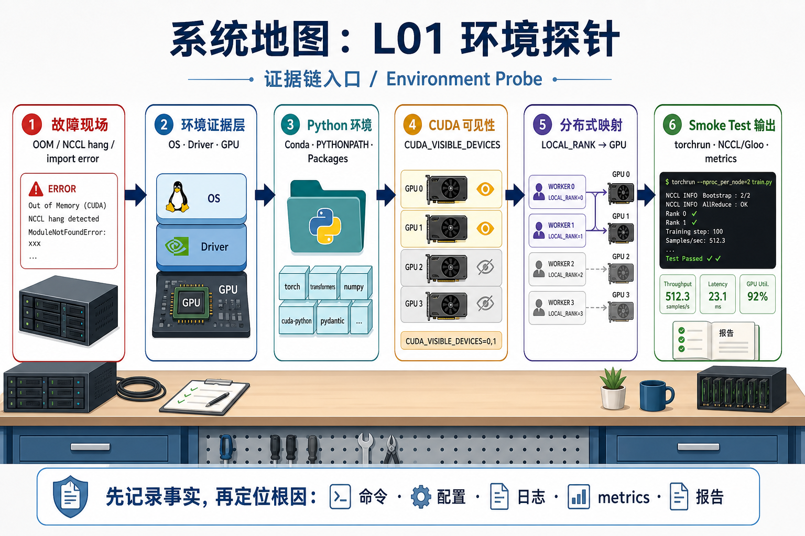
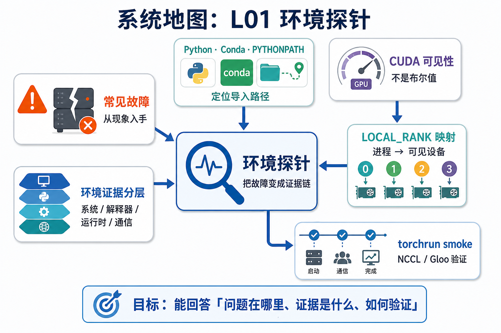

# 系统地图：L01 环境探针

L01 是整门课的证据链入口。后面的训练、推理、数据、RL 和多模态实验都会生成命令、配置、日志、metrics 和报告；如果第一讲没有把环境事实记录清楚，后面遇到 OOM、NCCL hang、CUDA 不可用或 import 错误时，很难判断根因在哪一层。

## 1. 环境证据链系统图

系统图把 L01 放在所有实验的入口：先确认 Python/Conda 和 import 路径，再检查 PyTorch wheel、CUDA 可见性、NCCL/Gloo 后端，最后用 torchrun 身份和 artifact 目录把这次环境事实固定下来。

## 2. Python、CUDA、rank 映射概念图

`sys.executable`、`PYTHONPATH`、`CUDA_VISIBLE_DEVICES`、`LOCAL_RANK`、`WORLD_SIZE` 是这节课的依赖链。只有先知道当前进程从哪里启动、看见哪些逻辑 GPU，才能解释 torchrun 日志里的 device 和物理 GPU 为什么对应或错位。

## 3. 本课边界

- patch 只实现环境快照、rank 映射和 drift diff，不证明 GPU 性能。
- smoke 才连接 PyTorch、NCCL/Gloo 和 torchrun artifact。
- 报告必须区分 CPU-only validation、本地单机 smoke 和 H200 真实运行。
