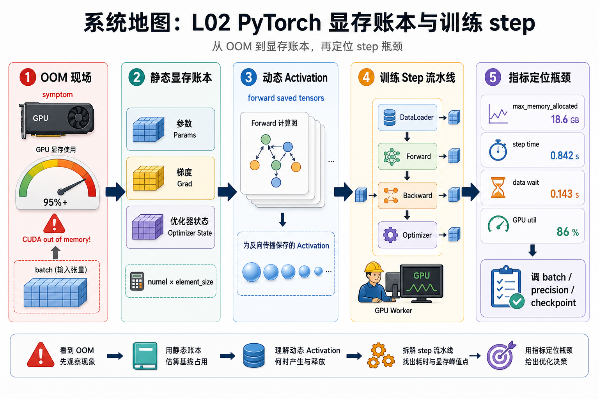
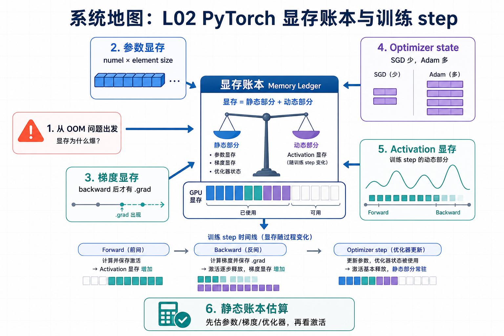

# 系统地图：L02 PyTorch 显存账本与训练 step

L02 是训练系统主线的第一个真正训练课。L01 解决环境证据，L02 进入模型训练本身：参数、梯度、optimizer state 和 activation 如何占显存，一个 step 如何分成 dataloader、forward、backward、optimizer，哪些指标能证明瓶颈在哪一段。

## 1. 训练 step 显存账本系统图

系统图按一次训练 step 展开：参数常驻，forward 产生 activation，backward 写出梯度，optimizer 再引入状态和更新。每个对象都能落到 numel、dtype、shape、峰值和 artifact。

## 2. 参数、梯度、optimizer、activation 概念图

概念依赖从 `numel * element_size` 开始，再进入 `.grad` 何时出现、SGD/Adam state 差异、activation 峰值和 profiler 证据。显存不是一个单数，必须拆成静态账本和动态峰值。

## 3. 本课边界

- patch 验证账本计算和训练 step 证据，不覆盖真实大模型 OOM 全部来源。
- activation 需要运行时观察，不能只靠参数量估算。
- 结论要带 dtype、batch、sequence、模型配置和 profiler/artifact。
