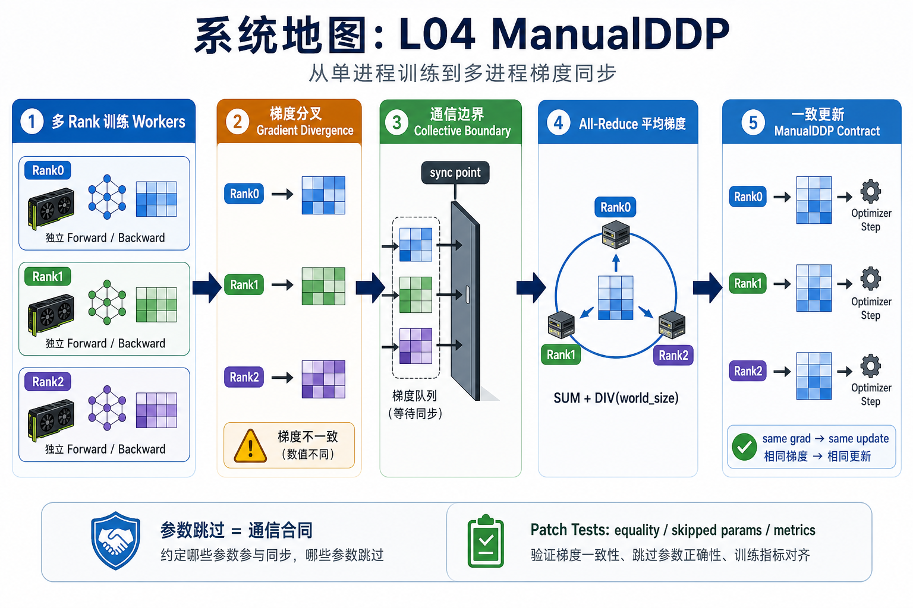
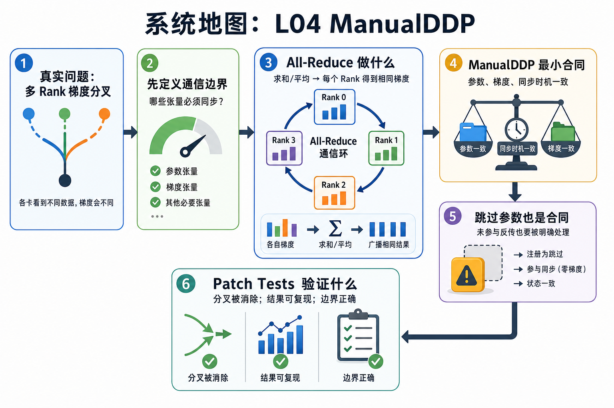

# 系统地图：L04 ManualDDP

L02 讲单进程训练 step，L03 讲长期 OOM 的 snapshot 归因。L04 把训练扩展到多个进程：每个 rank 先独立 forward/backward，随后通过 collective 把梯度同步成一致的平均值。这是理解 DDP、Megatron data parallel、ZeRO/FSDP 梯度同步和后续通信重叠的入口。

## 1. ManualDDP 梯度同步系统图

系统图展示多 rank 训练中梯度如何分叉再合并：每个 rank 本地 forward/backward，梯度进入 all-reduce，平均后再让 optimizer 在相同参数状态上前进。

## 2. rank、all-reduce、跳过参数概念图

概念依赖从 rank/world size 开始，进入 collective 顺序和 tensor shape，再到跳过参数的通信合同。只要有一个 rank 少进一次 collective，正确性问题就可能变成 hang。

## 3. 本课边界

- ManualDDP 只覆盖最小梯度同步语义，不等价于完整 PyTorch DDP。
- CPU/gloo 测试证明数值合同，不证明 NCCL 性能。
- 跳过未参与 loss 的参数也是同步协议的一部分，不能靠默认行为猜。
