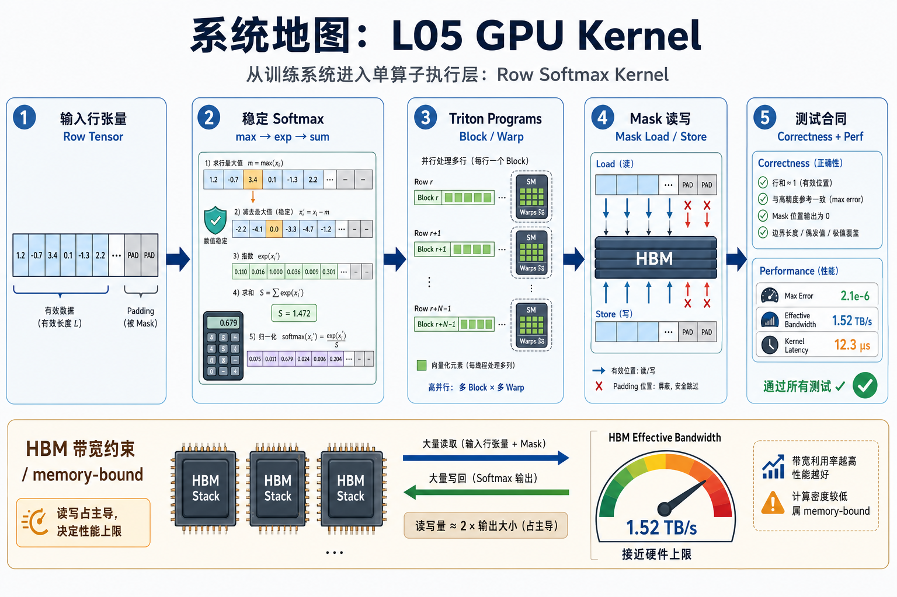
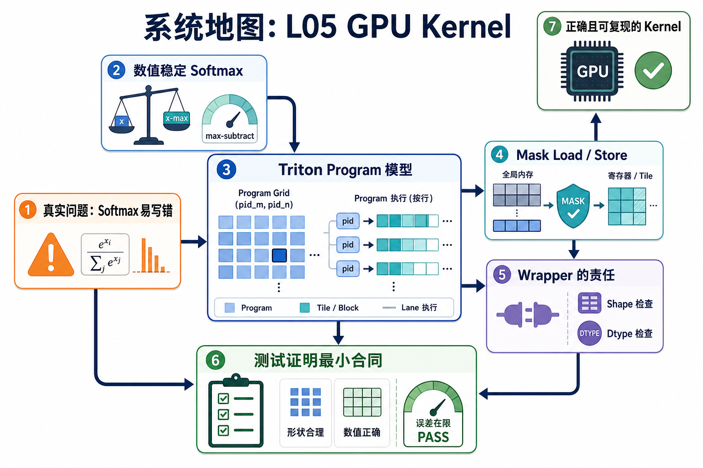

# 系统地图：L05 GPU Kernel

L05 从训练系统进入单算子执行层。前面几讲已经建立环境证据、训练 step 账本、snapshot 归因和多 rank grad 同步；这一讲把视角压到一个 GPU kernel：行 softmax 如何稳定计算，如何处理 padding，为什么性能常被 HBM 读写限制。

## 1. Triton 行 Softmax 系统图

系统图把一行 logits 交给一个 Triton program：block 读取、mask 无效位置、减最大值保证数值稳定、求 exp/sum，最后把 softmax 写回输出。

## 2. 稳定 softmax、program、mask 概念图

概念图的主线是公式先转成稳定计算，再映射到 Triton program 模型。mask load 防止越界读，mask store 防止越界写，wrapper 负责 grid、block size 和 dtype 边界。

## 3. 本课边界

- patch 检查单算子数学和边界，不覆盖生产 fused attention。
- benchmark 结论必须带 shape、dtype、block size、硬件和计时方法。
- 数值稳定错误通常比性能问题更先破坏训练。
