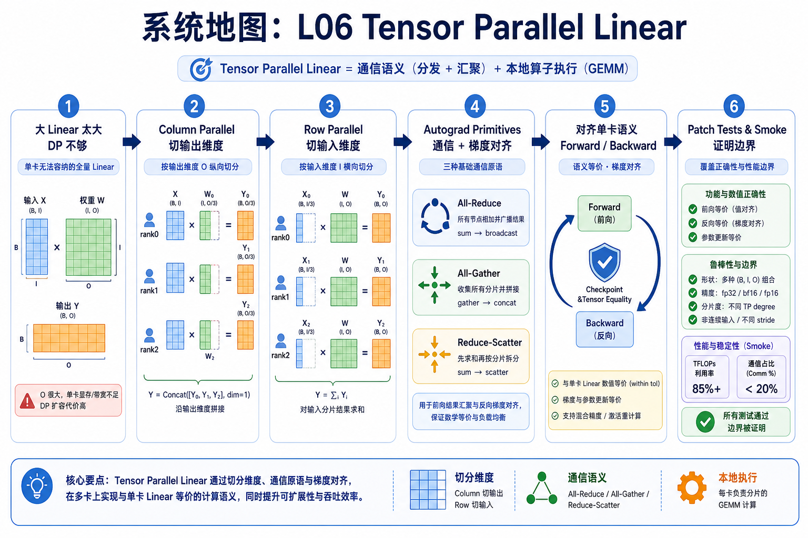
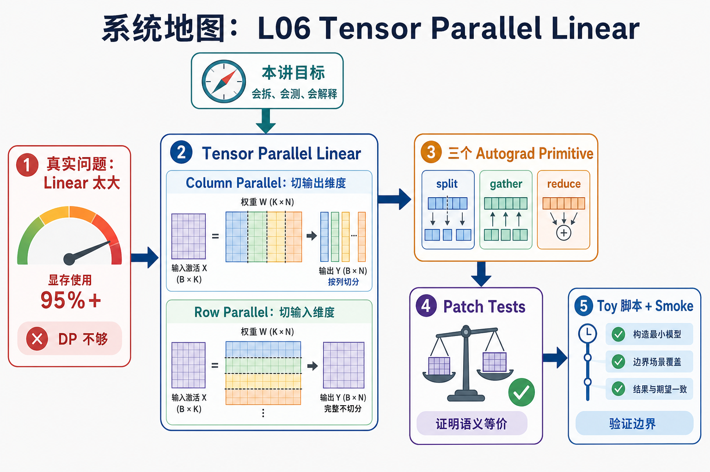

# 系统地图：L06 Tensor Parallel Linear

L06 把前面三条线合在一起：L04 讲过 all-reduce 和 all-gather 的通信语义，L05 讲过单算子的局部执行，本讲把这些能力放进一个 `nn.Linear`。目标是让多个 rank 合作完成同一个线性层，同时让 forward 和 backward 与单卡结果对齐。

## 1. Tensor Parallel Linear 系统图

系统图围绕一个过大的 `nn.Linear` 展开：Column Parallel 切输出维度，Row Parallel 切输入维度，forward/backward 在 copy、reduce、gather 三个 autograd primitive 之间切换。

## 2. Column、Row、autograd collective 概念图

概念依赖先固定 weight shape `(out, in)`，再决定切哪一维。Column 的输入梯度要 reduce，Row 的 partial output 要 reduce，gather 的 backward 要把梯度切回本 rank。

## 3. 本课边界

- 2-rank CPU/gloo 测试证明语义，不证明 GPU/NCCL 性能。
- Row bias 只能在 reduce 后加一次。
- TP checkpoint 是分片权重，改变 TP size 需要重组和重新切分。
