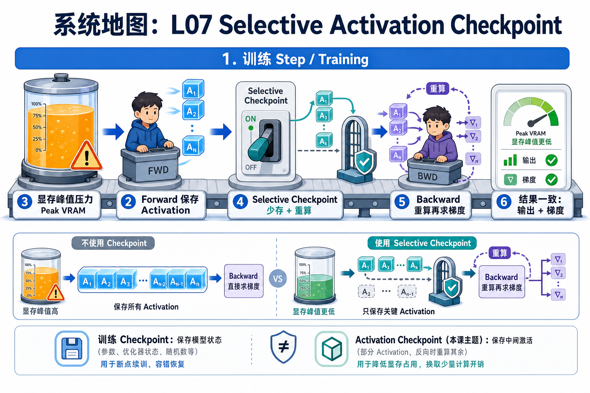
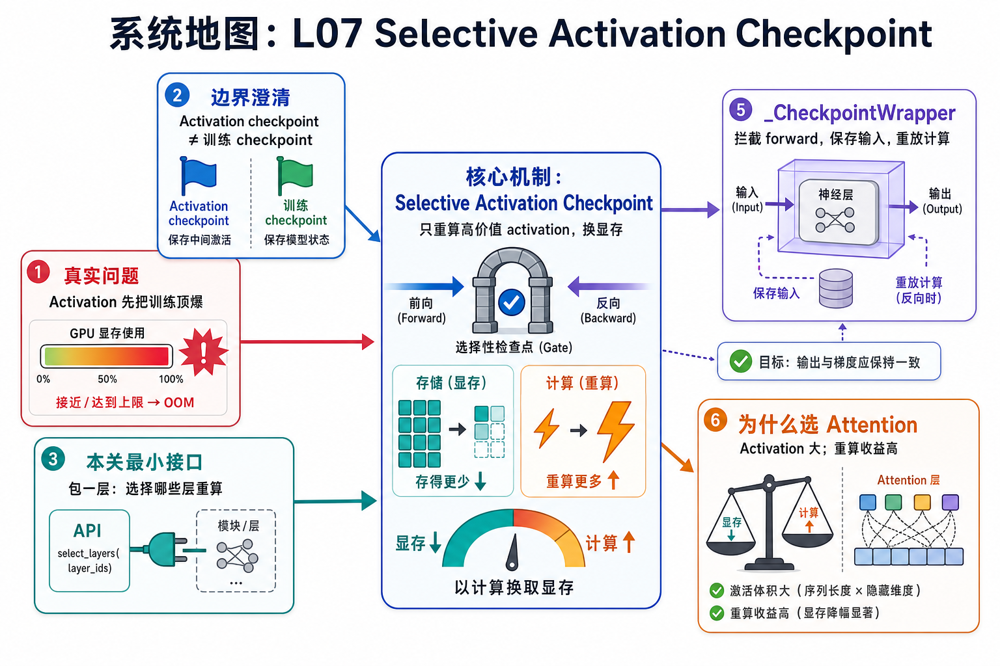

# 系统地图：L07 Selective Activation Checkpoint

L07 回到训练 step 内部，处理 activation 显存。前面 L02 已经把参数、梯度和 optimizer state 账本讲清；本讲关注另一类峰值来源：forward 为 backward 保存的中间 activation。选择性 checkpoint 用额外 forward 计算换取峰值显存下降。

## 1. Selective Activation Checkpoint 系统图

系统图展示训练内存压力如何被转移：普通 forward 保存 activation，checkpoint wrapper 只保留必要输入，backward 时重算被包住的模块，用额外计算换显存。

## 2. activation、recompute、RNG 边界概念图

概念依赖从 activation 峰值开始，到 selective wrapper、重算 forward、梯度一致性和 RNG 处理。它和保存训练 checkpoint 是两件事：一个管反向重算，一个管故障恢复。

## 3. 本课边界

- patch 验证 wrapper 选择和输出/梯度一致性。
- 真实训练还要考虑 dropout RNG、compile、FSDP 和通信重叠。
- 是否值得 checkpoint 要用显存节省和重算开销共同判断。
