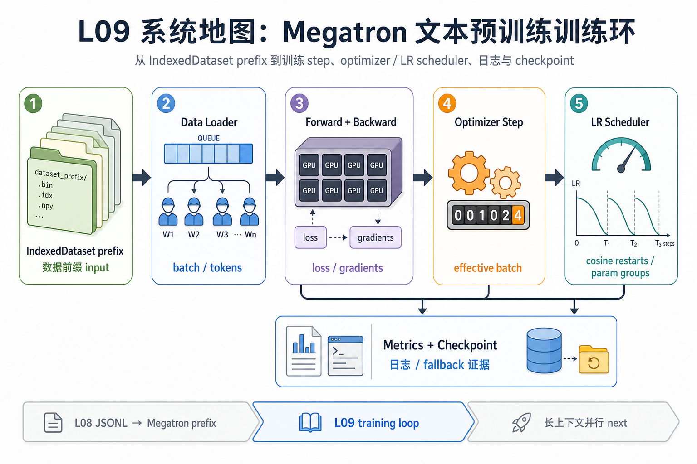
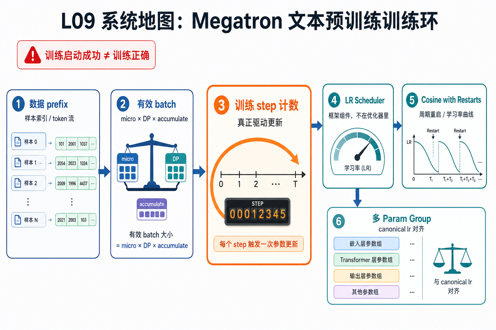

# L09 系统地图：Megatron 文本预训练训练环

这一讲的位置在数据预处理之后、长上下文并行之前。L08 已经把 JSONL 文本变成 Megatron 可读的 IndexedDataset prefix；L09 关注训练 loop 如何消费这个 prefix，怎样推进 optimizer 和 LR scheduler，怎样把日志、checkpoint 和 fallback 证据留给后续排查。

## 1. Megatron 预训练 step 系统图

系统图从数据 prefix 进入 train step：dataloader 供给 batch，模型 forward 产生 loss，optimizer/scheduler 推进 step，metrics 和 checkpoint 记录训练是否真正前进。

## 2. 有效 batch、LR scheduler、loss 合同概念图

概念依赖是有效 batch 决定 scheduler 计数，loss 输出合同决定反向路径，多个 param group 需要 canonical lr，cosine restart 则要求把 step 和周期边界写准。

## 3. 本课边界

- patch 聚焦训练环和 scheduler 语义，不训练真实大模型。
- 启动成功不等于训练有效，必须看 loss、lr、step 和 artifact。
- 多卡生产路径还会叠加 DP/TP/PP、checkpoint 和通信 overlap。
