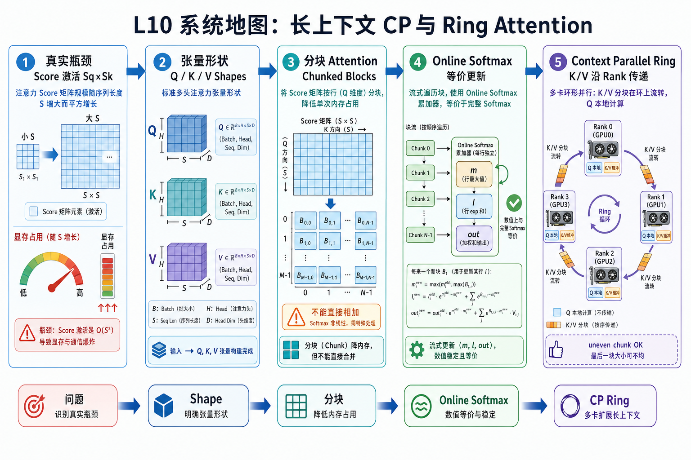
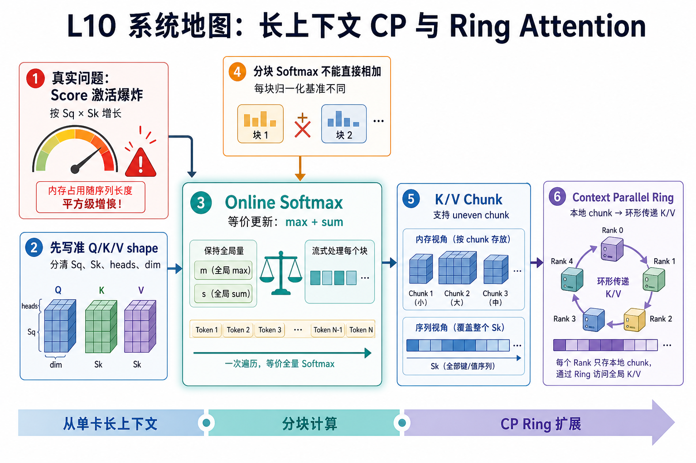

# L10 系统地图：长上下文 CP 与 Ring Attention

L10 位于训练 loop 之后，开始处理长上下文训练的核心瓶颈。L09 让学生看清 optimizer、scheduler、日志和 checkpoint；L10 聚焦 attention 层内部：完整 score 矩阵为什么会推高激活显存，online softmax 怎样让分块 attention 与 full attention 等价，Context Parallel 怎样把 K/V 分散到多个 rank 上沿 ring 传递。

## 1. 长上下文 Context Parallel 系统图

系统图从 `Sq * Sk` attention 激活膨胀进入：Q/K/V 被切成 chunk，online softmax 维护局部统计，Context Parallel 再用 ring 让每个 rank 逐块看到远端 K/V。

## 2. QKV chunk、online softmax、ring 概念图

概念依赖先固定 Q/K/V shape，再理解分块 softmax 为什么不能直接相加。online softmax 的 max/sum 更新让多个 chunk 等价于完整 softmax，这是 CP ring 能成立的数学基础。

## 3. 本课边界

- patch 证明 online softmax 和 chunk 边界，不覆盖完整 Megatron CP。
- uneven chunk 会暴露 shape 和 mask 边界。
- 长上下文性能结论要同时看显存、通信和 attention backend。
