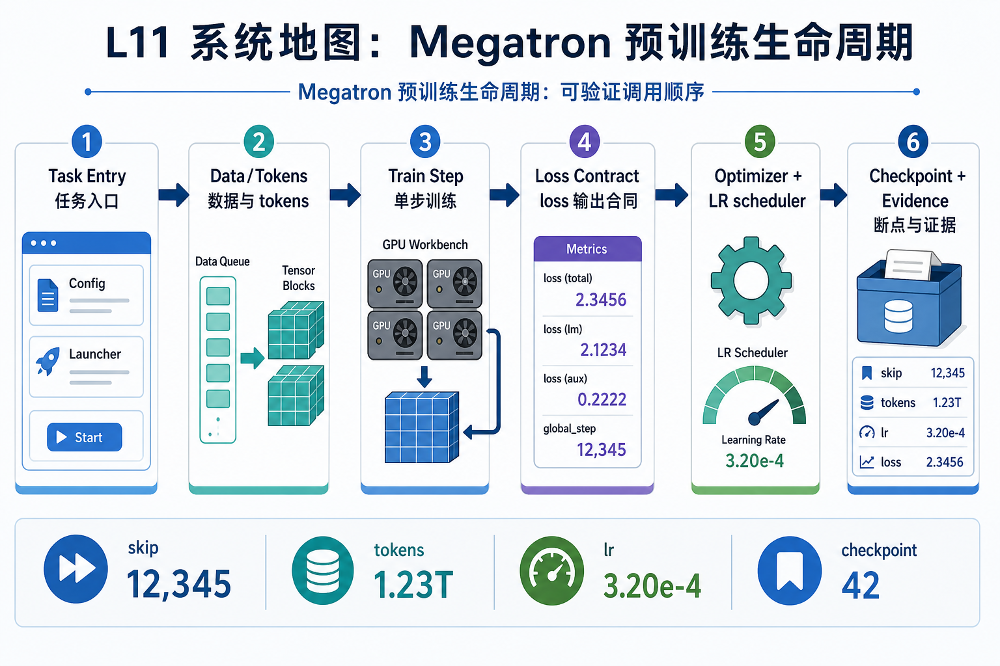
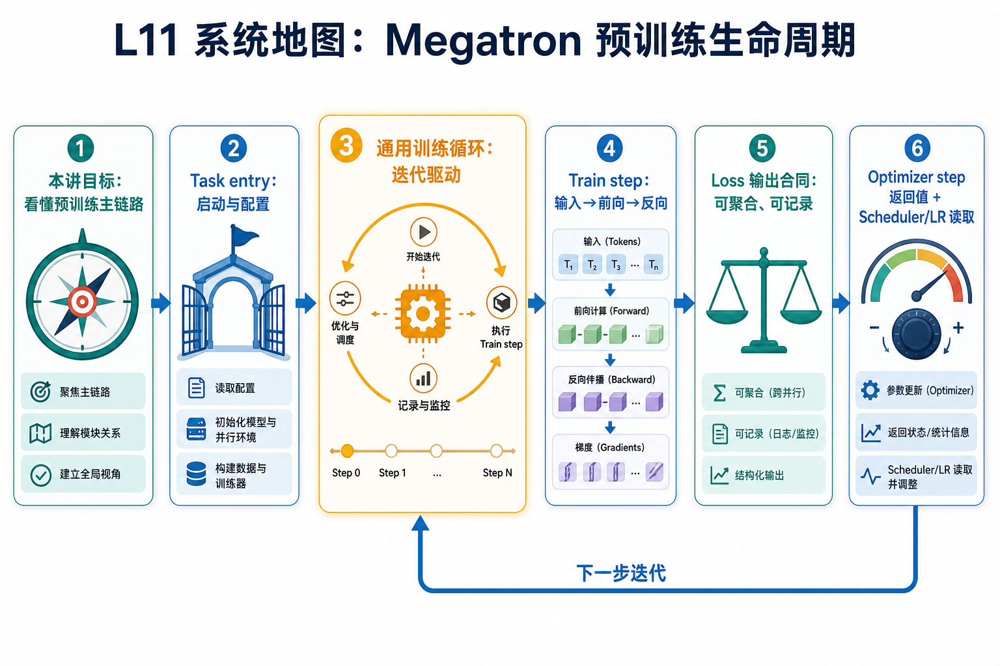

# L11 系统地图：Megatron 预训练生命周期

L11 把前面几讲的局部组件放回训练生命周期：数据已经能进入 Megatron，scheduler 已经能单独测试，长上下文已经建立了系统边界。现在要把单步训练写成可验证的调用顺序，并把 loss、lr、skip、tokens 和 checkpoint 证据留给后续排查。

## 1. Megatron 预训练生命周期系统图

系统图从 task entry 进入通用训练循环：构建模型和数据，执行 train step，返回 loss 与统计，optimizer/scheduler 更新，再把 checkpoint、metrics 和 report 接入生命周期。

## 2. train step 输入输出合同概念图

概念依赖集中在 train step 合同：batch 输入、forward 输出、loss 缩放、optimizer 返回值和 scheduler 读取顺序。任何一个返回值含义不清，外层生命周期就无法稳定接管。

## 3. 本课边界

- patch 只验证生命周期骨架和返回值语义。
- 真实 Megatron 还会叠加 distributed init、parallel state 和 checkpoint strategy。
- 排查时先定位是 task entry、data、step、optimizer 还是 artifact 链路。
