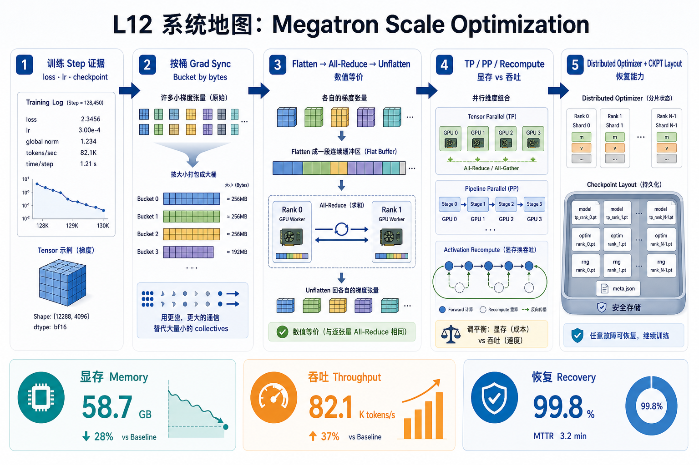
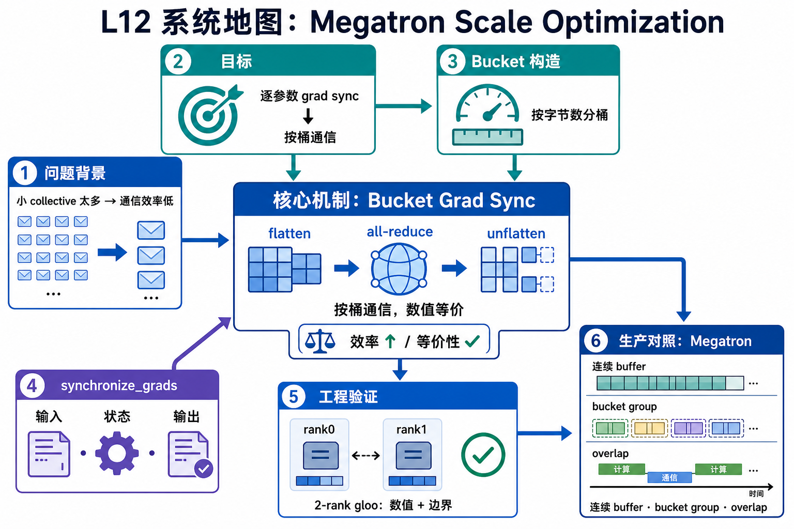

# L12 系统地图：Megatron Scale Optimization

L12 把 L11 的训练 step 放到多卡扩展场景里。单步训练已经能写出 loss、lr 和 checkpoint 证据后，下一步要判断数据并行梯度同步、TP/PP/recompute、distributed optimizer 和 checkpoint layout 对显存、吞吐和恢复能力的影响。

## 1. Bucketed Manual DDP 系统图

系统图把逐参数 all-reduce 改成按桶通信：先按字节数组 bucket，flatten 成连续 buffer，all-reduce 一次，再 unflatten 写回各参数梯度。

## 2. bucket、flatten、all-reduce 概念图

概念依赖是 bucket size 决定 collective 数量，flatten/unflatten 保持数值等价，all-reduce 顺序保持所有 rank 一致。优化点不是改变数学，而是减少小 collective 的启动开销。

## 3. 本课边界

- 2-rank gloo 只能验证数值和边界。
- 生产 Megatron 还会用连续 buffer、bucket group 和 overlap。
- 性能比较要给出 bucket size、参数规模、backend 和计时口径。
