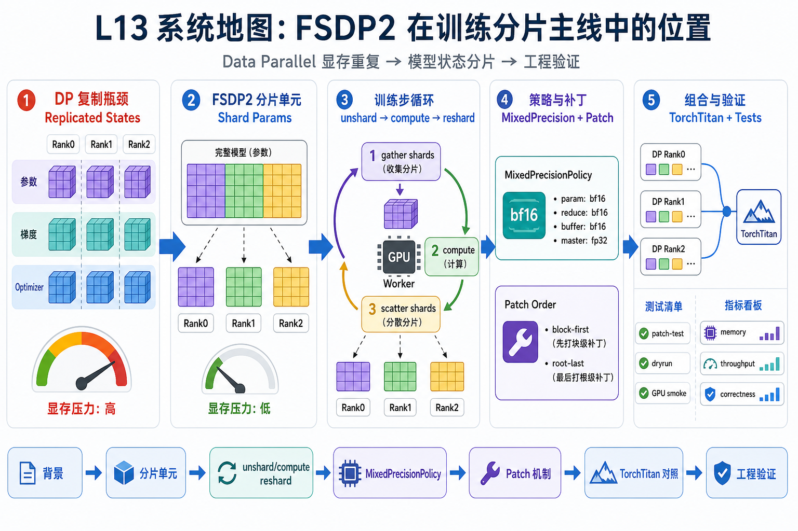
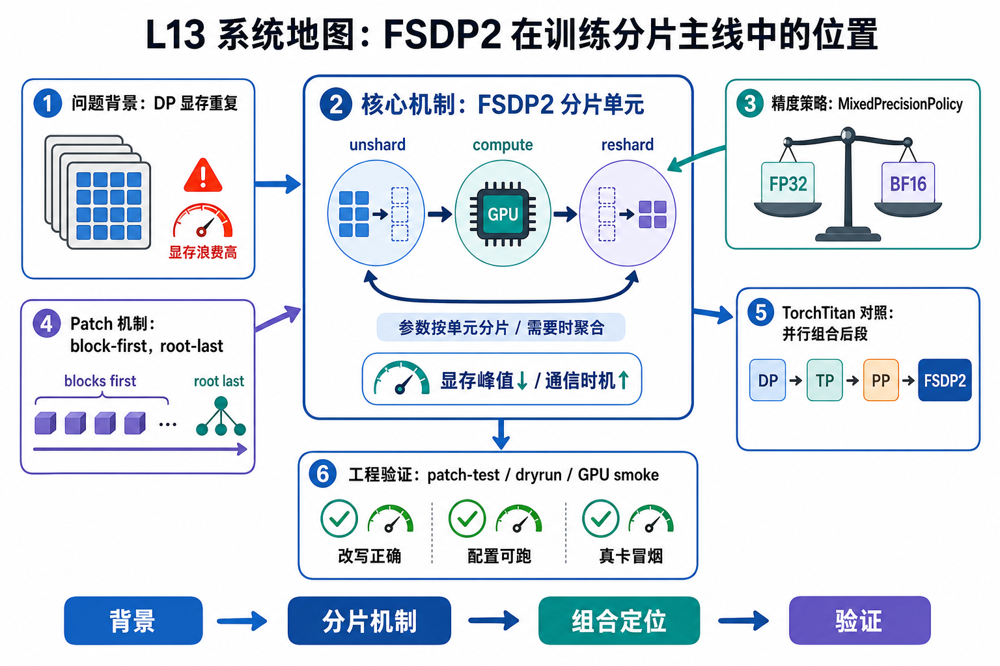

# L13 系统地图：FSDP2 在训练分片主线中的位置

L13 处在训练系统扩展的 data parallel 分片层。L12 已经解释了 data parallel 梯度通信和 scale optimization 的评审方式；这一讲继续追问：如果每个 rank 都复制完整参数、梯度和 optimizer state，显存不够时系统该怎样组织模型状态。

## 1. FSDP2 Llama block 分片系统图

系统图展示 Data Parallel 重复显存如何被 FSDP2 分片：按 block 包装，计算前 unshard，计算后 reshard，root wrapper 最后包住全局状态。

## 2. shard、unshard、reshard、mixed precision 概念图

概念依赖从分片单元开始，进入 unshard/compute/reshard 的时序，再到 MixedPrecisionPolicy 的 dtype 边界。block-first、root-last 是避免包装顺序破坏语义的关键。

## 3. 本课边界

- patch 验证包装策略和 dryrun 语义，不代表真实吞吐。
- FSDP2 与 TP/PP/activation checkpoint 的组合会改变显存和通信边界。
- GPU smoke 才能讨论集群上的内存节省和 step time。
