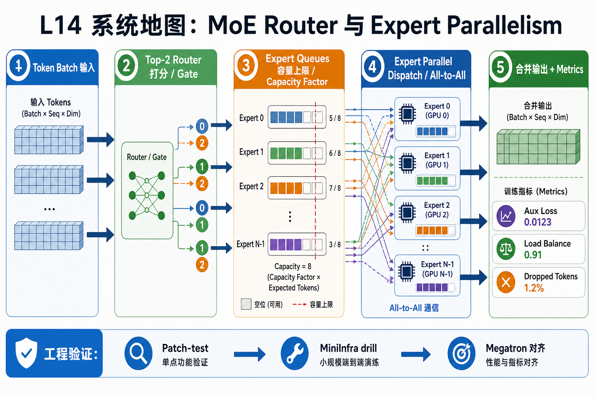
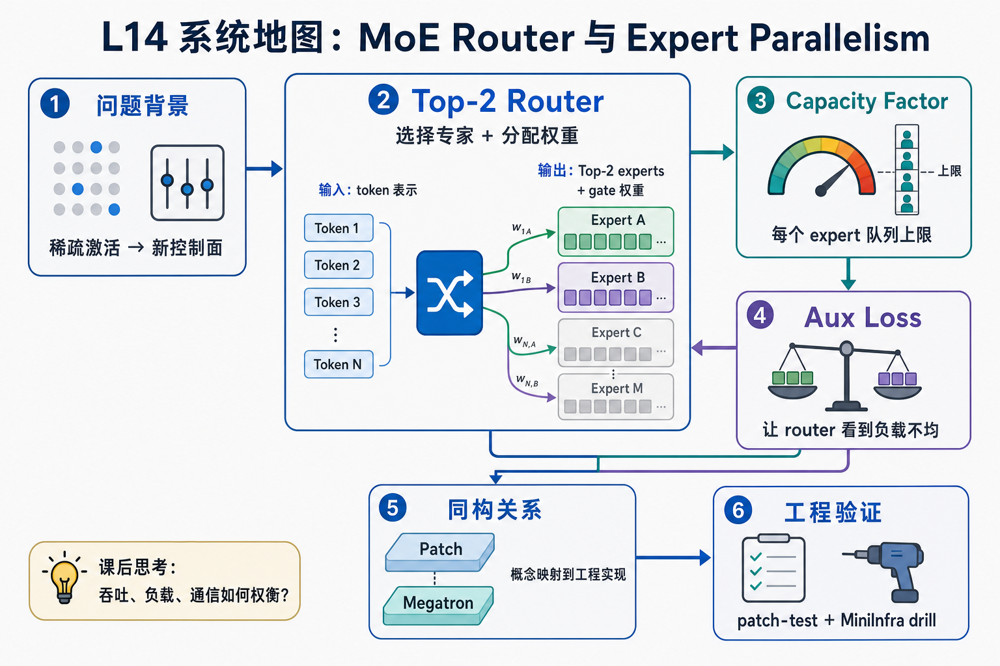

# L14 系统地图：MoE Router 与 Expert Parallelism

L14 处在训练系统的稀疏模型层。前面课程已经讲过 data parallel 通信、FSDP2 分片和训练 step 证据；这一讲把问题换成 MoE：每个 token 只激活少数 expert，系统必须决定 token 去哪、容量是否足够、通信怎么组织。

## 1. MoE Router 与 Expert Parallel 系统图

系统图从 token 进入 router：Top-2 选择 expert，capacity 限制每个 expert 队列，aux loss 约束负载均衡，Expert Parallel 再把 expert 分布到不同 rank。

## 2. Top-2、capacity、aux loss 概念图

概念依赖是 router score 先决定 token 去哪里，capacity factor 决定队列能接多少，溢出 token 和 aux loss 再决定训练稳定性。MoE 的难点不只是稀疏 FFN，而是控制面。

## 3. 本课边界

- patch 验证 router、capacity 和 aux loss 的最小语义。
- 真实 Megatron 还要处理 dispatch/combine、EP 通信和 token drop。
- 吞吐结论必须同时看 expert 负载、溢出率和通信。
