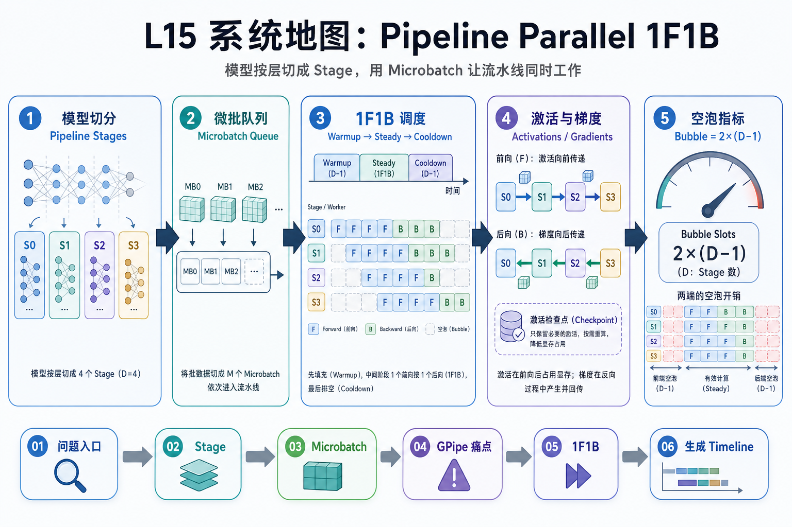
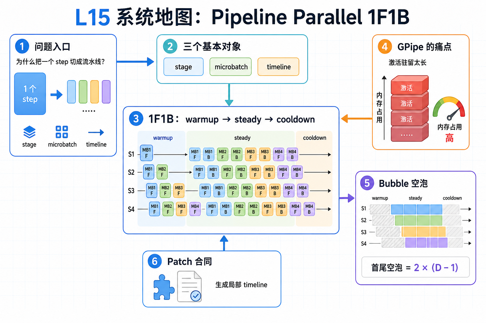

# L15 系统地图：Pipeline Parallel 1F1B

L15 处在训练并行主线的模型切分层。前面课程已经讲过数据并行通信、FSDP2 状态分片和 MoE/EP token dispatch；这一讲把模型按层切成 pipeline stage，再用 microbatch 让多个 stage 同时工作。

## 1. Pipeline 1F1B 调度系统图

系统图把一个训练 step 切成 stage 和 microbatch：warmup 填满流水线，steady 阶段 forward/backward 交替，cooldown 排空剩余反向，首尾 bubble 是代价。

## 2. stage、microbatch、bubble 概念图

概念依赖从 stage 切分和 microbatch 编号开始，进入 forward dependency、backward dependency 和 1F1B timeline。bubble_count 的意义是把设备空闲时间变成可计算合同。

## 3. 本课边界

- patch 只生成局部 timeline，不实现 P2P tensor 通信。
- 真实 Megatron schedule 还要处理 send/recv、activation 保存和梯度收尾。
- 排查 pipeline hang 时先检查所有 stage 的事件顺序是否一致。
