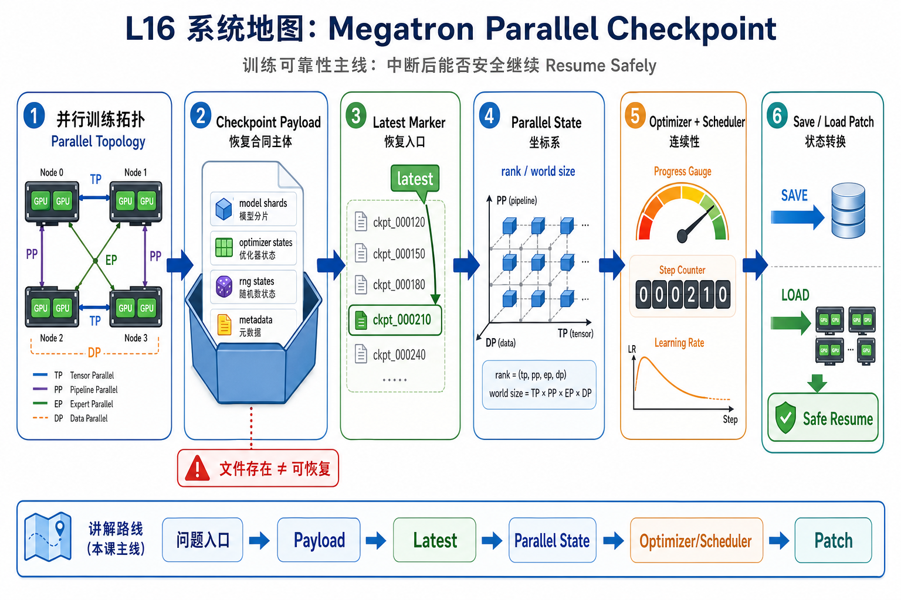
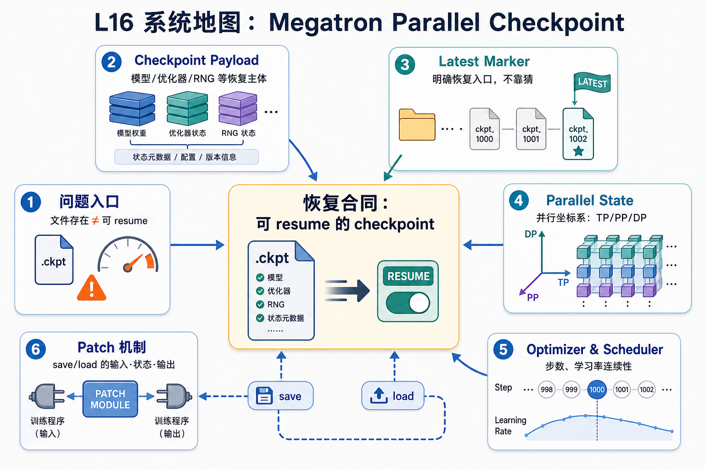

# L16 系统地图：Megatron Parallel Checkpoint

L16 处在训练可靠性主线。前面课程已经建立了训练 step、FSDP2、MoE/EP 和 PP 的并行视角；这一讲把这些并行拓扑写入 checkpoint 语义，回答“训练中断后能否安全继续”的问题。

## 1. Parallel Checkpoint 恢复系统图

系统图把 checkpoint 拆成可恢复合同：payload 保存模型/optimizer/scheduler，latest marker 指向入口，parallel state 记录 DP/TP/PP 坐标。

## 2. payload、marker、parallel state 概念图

概念依赖是文件存在不等于可 resume；必须同时满足 payload 完整、marker 正确、并行坐标匹配、optimizer 和 scheduler 连续。少一块都会变成 silent drift。

## 3. 本课边界

- patch 验证 save/load 的最小数据合同。
- 改变并行度时 checkpoint 需要转换，不能直接加载本地 shard。
- 恢复报告要记录 step、parallel state、optimizer/scheduler 和 latest marker。
