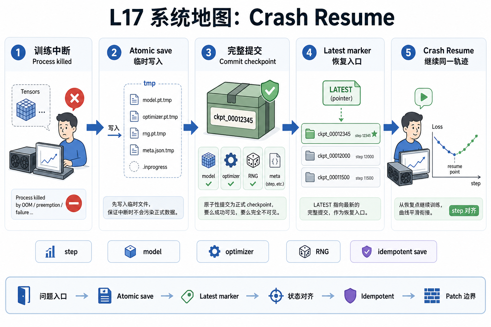
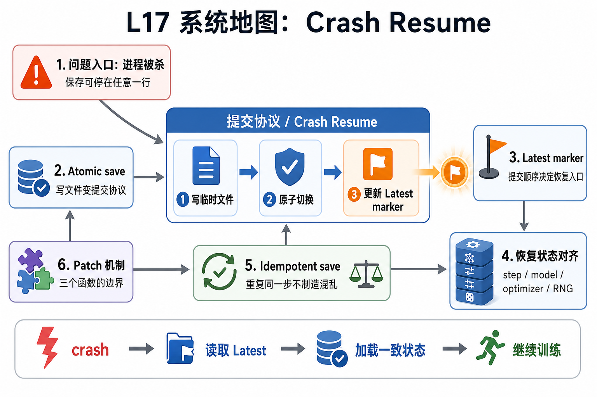

# L17 系统地图：Crash Resume

L17 处在训练可靠性主线。L16 已经讲过 checkpoint payload、latest marker 和 parallel_state 兼容性；这一讲继续处理保存中途崩溃和恢复后数值轨迹连续性。目标是让训练进程被杀后，重启作业能找到最近一次完整提交的 checkpoint，并继续同一条训练轨迹。

## 1. Crash-safe Resume 系统图

系统图把保存流程变成提交协议：先写临时 payload，再原子 rename，最后更新 latest marker。进程在任意一行被杀，恢复入口仍应指向一个完整 checkpoint。

## 2. atomic save、latest marker、RNG 概念图

概念依赖是 atomic save 保护文件完整性，latest marker 保护恢复入口，step/model/optimizer/RNG 保护训练连续性，idempotent save 则保证重复保存不会制造混乱。

## 3. 本课边界

- patch 验证文件提交协议和恢复状态。
- 真实训练还要考虑分布式多 rank 同步和远端存储一致性。
- 排查 resume 要先看 marker 指向、payload 完整性和 step/RNG 是否对齐。
