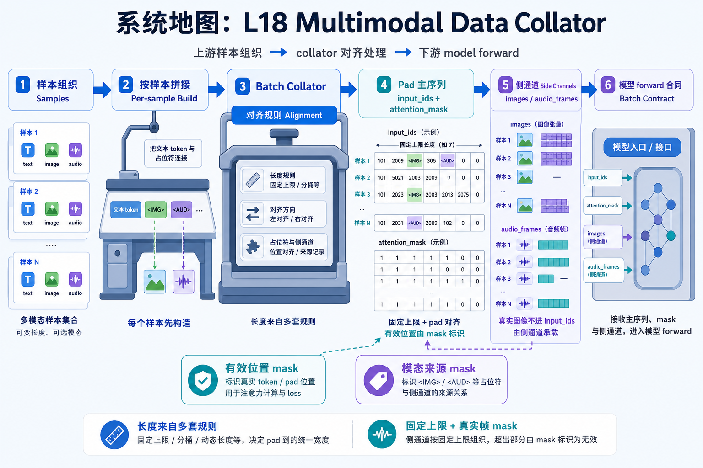
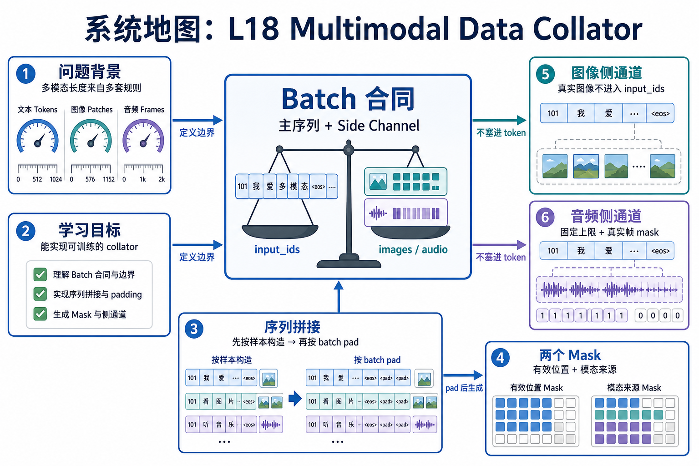

# 系统地图：L18 Multimodal Data Collator

L18 位于数据与多模态主线中间。它连接上游样本组织和下游模型 forward，重点是定义一个 batch 内各模态怎样对齐。

## 1. Multimodal Collator 系统图

系统图把多模态样本拼成 batch：文本 token 进入主序列，图像和音频进入 side channel，padding、attention mask 和 modality mask 保证 batch 内对齐。

## 2. 主序列、side channel、mask 概念图

概念依赖是先按单样本构造序列，再按 batch pad；图像/audio 不直接塞进 `input_ids`，而是通过 side tensor 和 mask 与 image token 或音频位置对齐。

## 3. 本课边界

- patch 验证 collate 合同，不处理真实图片解码或音频特征提取。
- side tensor 顺序必须可解释，否则多模态错位很难排查。
- 报告要说明文本长度、图像数量、音频帧上限和各类 mask shape。
