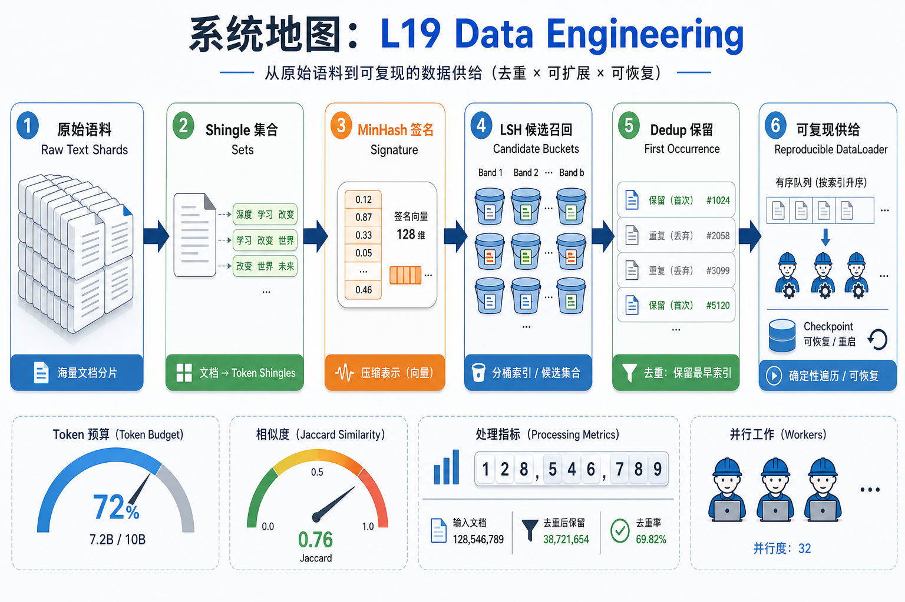
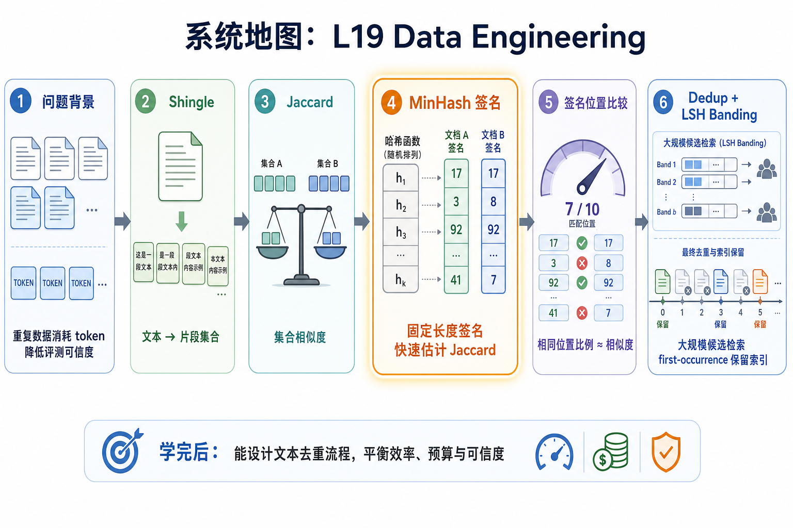

# 系统地图：L19 Data Engineering

L19 接在 L18 的多模态 collator 后面，关注训练前的数据质量和数据供给。它回答三个问题：哪些文本太重复，数据怎样顺序进入 worker，坏 shard 或重启时如何保留可复现顺序。

## 1. 数据去重与 shard resume 系统图

系统图从原始文本进入数据工程流水线：shingle 变集合，MinHash 变签名，LSH banding 找候选，dedup 保留 first occurrence，WebDataset shard 负责可恢复交付。

## 2. shingle、MinHash、LSH、shard 概念图

概念依赖是 Jaccard 先定义相似度，MinHash 用签名估计它，LSH 用 band 降低候选规模，shard resume 再保证长作业中断后能继续写一致产物。

## 3. 本课边界

- patch 覆盖近重复去重和 shard 状态，不代表完整数据治理。
- 误杀和漏检取决于 shingle 粒度、签名长度和 band 配置。
- 数据报告必须记录保留索引、候选数量、阈值和可恢复状态。
