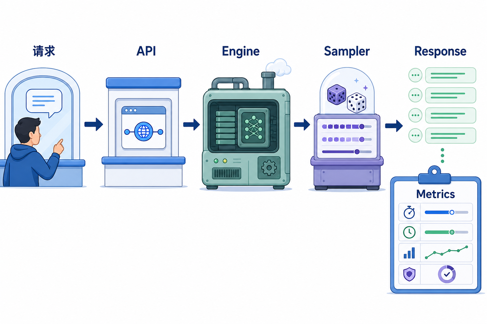
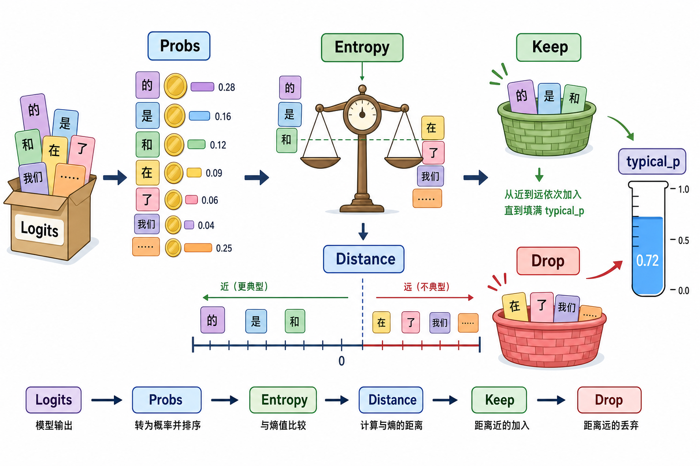

# 系统地图：L20 vLLM Serving Baseline

L20 是推理服务主线入口。它先建立一个可复查的 serving baseline，再把采样过滤器放到 sampler 链路里，说明请求、采样参数、logits、token selection 和 metrics 的边界。

## 1. Serving baseline 系统图

这节课的系统边界是：OpenAI-compatible 请求先进入 API facade，再交给 `LLMEngine`，模型 forward 后由 sampler 选择 token，最后把 response 和 serving metrics 一起落成证据。这里的 baseline 不只看“能不能返回”，还要记录模型名、端口、请求参数、TTFT、ITL、吞吐和 `validation_only` 状态。

## 2. Typical-p 概念图

typical-p 的关键不是“按概率从大到小保留”，而是先把 logits 变成概率，计算每个 token 的 surprisal，再和分布 entropy 比距离。距离越小，说明 token 的信息量越接近当前分布的典型水平；按这个距离排序后累计概率质量，达到 `typical_p` 后过滤剩余 token，同时至少保留一个 token。

## 3. 本课边界

- `run_vllm_lab.py` 负责建立 serving 证据链；如果端口没开，它只能产出 `validation_only`，不能写成真实 serving 性能。
- patch 只实现 `typical_p_filter(logits, typical_p, filter_value)`，训练的是 sampler 过滤器的排序、累计和 scatter 语义。
- 真实 vLLM 源码里还会有 temperature、logits processors、top-k、top-p、min-p、greedy/random 分支；本课只把 typical-p 放进这条 sampler 主线里理解。
