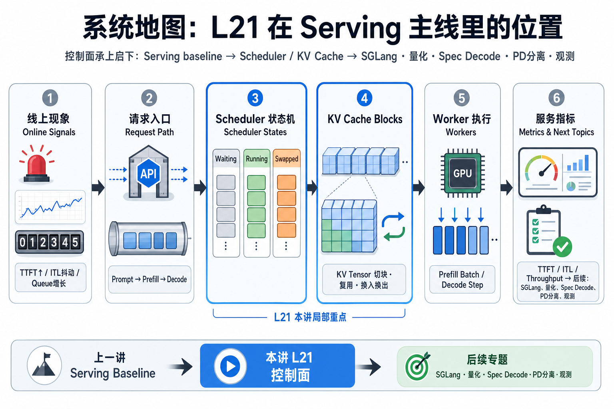
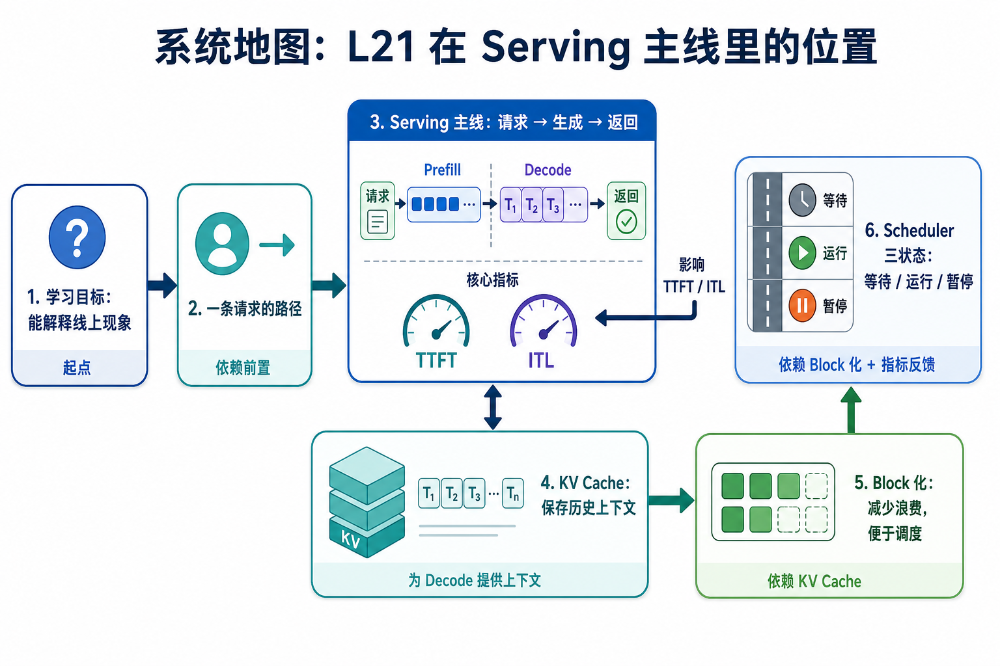

# 系统地图：L21 在 Serving 主线里的位置

这一讲处在推理服务的控制面。它连接上一讲的 serving baseline，也为后面的 SGLang、量化、Spec Decode、PD 分离和观测打基础。

## 1. vLLM Scheduler 与 KV Block 系统图

系统图从请求进入 waiting 队列开始：scheduler 选择 prefill，KV manager 分配 block，running 请求进入 decode，finished 后释放 KV 并写出 TTFT/ITL。

## 2. prefill、decode、KV block、状态队列概念图

概念依赖是 prefill 决定首 token 前的工作量，decode 决定每步调度频率，KV block 把历史上下文变成可复用显存单元，waiting/running/finished 则是控制面状态机。

## 3. 本课边界

- patch 只实现调度器和 KV block 的最小合同。
- 真实 vLLM 还涉及 paged attention、chunked prefill、抢占和多 worker。
- 性能判断要同时看 TTFT、ITL、吞吐、KV 使用率和队列状态。
