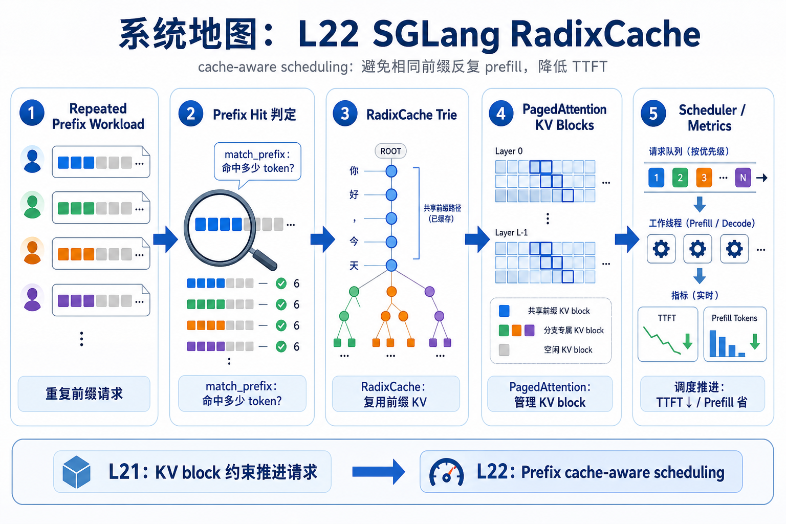
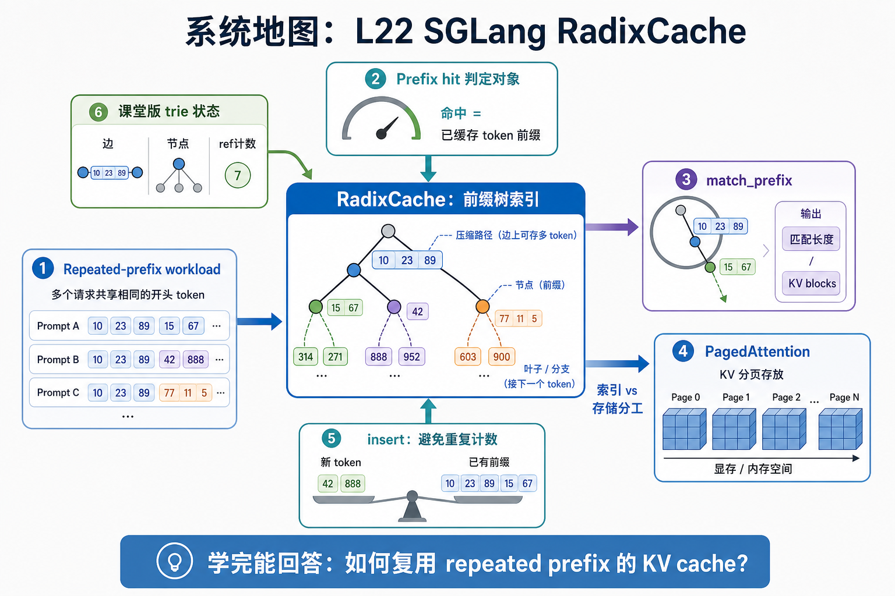

# 系统地图：L22 SGLang RadixCache

L22 处在推理服务的 cache-aware scheduling 层。L21 讲了 scheduler 怎样在 KV block 约束下推进请求；L22 关注另一类瓶颈：相同前缀被反复 prefill，导致 TTFT 被重复计算拖住。

## 1. SGLang RadixCache 系统图

系统图把重复前缀请求放进一棵 radix trie：match_prefix 找到可复用 KV，insert 把新前缀压缩进节点，LRU/evict 保护有限 cache 空间。

## 2. prefix hit、radix trie、LRU 概念图

概念依赖是 prefix hit 先定义复用对象，RadixCache 管理字符串/Token 前缀结构，PagedAttention 管理 KV block。访问时间必须随命中刷新，否则热前缀会被当成冷数据删除。

## 3. 本课边界

- patch 只覆盖课堂版 trie，不包含完整 serving runtime。
- prefix cache 命中率要结合 workload 的共享前缀分布解释。
- 驱逐逻辑必须保护仍被请求引用的节点。
