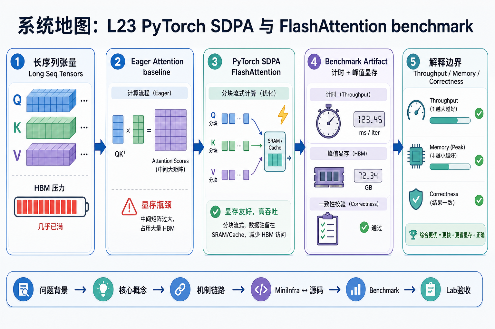
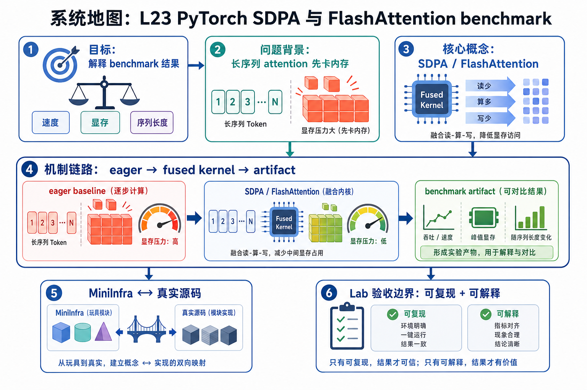

# 系统地图：L23 PyTorch SDPA 与 FlashAttention benchmark

这节课的第一屏不再用复杂系统地图展开，而是先用一张生成图片建立直觉，再进入讲义和源码。

## 1. SDPA 到 FlashAttention Benchmark 系统图

系统图把 attention 从 eager baseline 推到 backend benchmark：同一组 shape、dtype、mask 和 causal 条件下比较 SDPA/FlashAttention 的耗时、显存和 fallback。

## 2. HBM IO、tile、backend 条件概念图

概念依赖不是把 attention 复杂度变线性，而是减少 HBM 读写和中间矩阵驻留。head_dim、dtype、mask、dropout 和硬件条件决定能否走 FlashAttention 路径。

## 3. 本课边界

- lab 验证 benchmark artifact，不证明所有 shape 都更快。
- fallback 必须显式记录，否则性能结论会混淆 backend。
- 报告要给 shape、dtype、sequence、head_dim、causal 和显存峰值。
