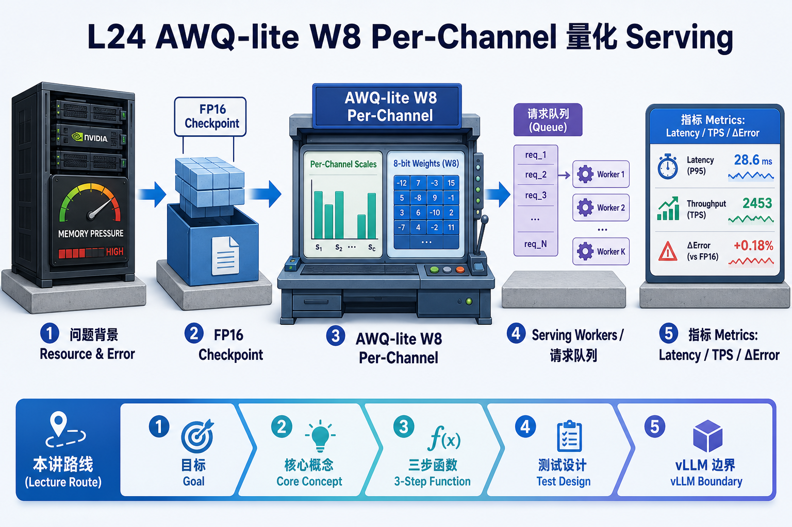
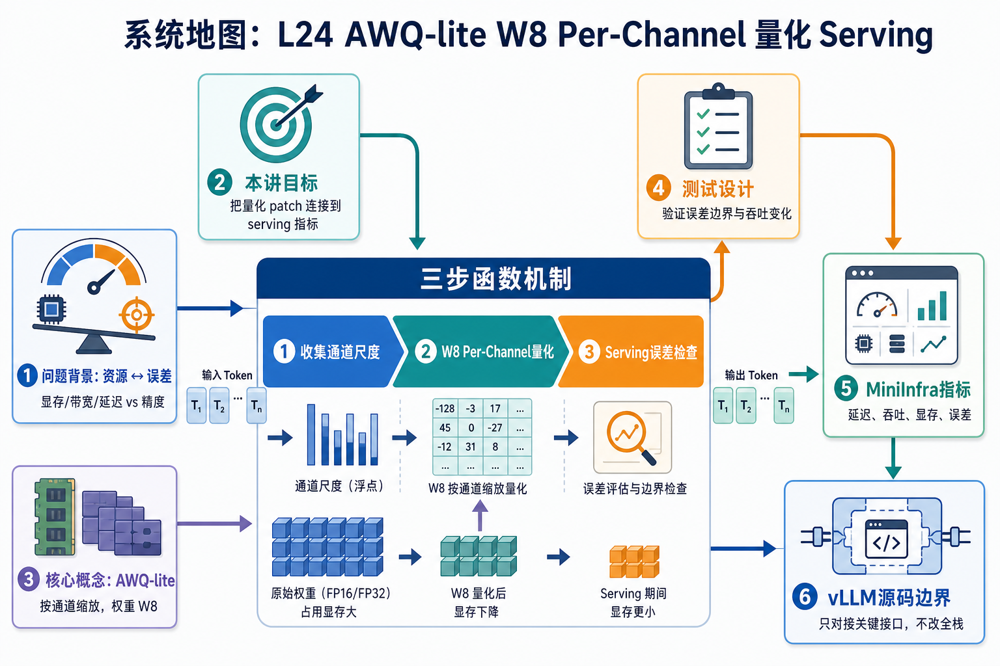

# 系统地图：L24 AWQ-lite W8 Per-Channel 量化 Serving

这节课的第一屏不再用复杂系统地图展开，而是先用一张生成图片建立直觉，再进入讲义和源码。

## 1. AWQ-lite 量化 Serving 系统图

系统图把 FP 权重进入校准和量化：按 channel 计算 scale，写成 int8 权重，反量化参与推理，再用误差和 serving metrics 评估资源收益。

## 2. scale、int8 weight、误差边界概念图

概念依赖是 scale 决定 int8 表示范围，per-channel 比 per-tensor 更贴近不同输出通道分布，误差评估决定这次压缩是否还能服务。

## 3. 本课边界

- patch 是 AWQ-lite 数学合同，不是完整 AWQ pipeline。
- 生产量化还要处理 kernel、checkpoint 格式和校准集代表性。
- serving 结论要同时看显存、吞吐、延迟和质量误差。
