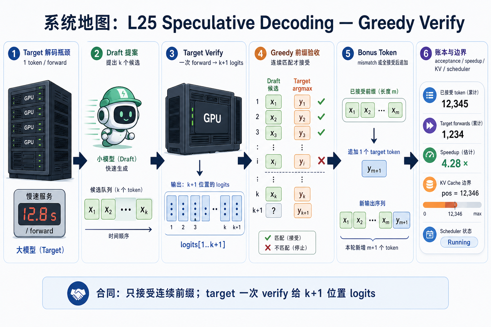
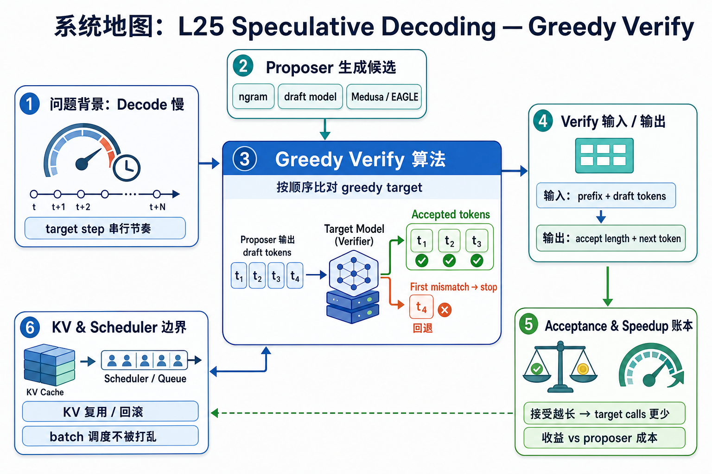

# 系统地图：L25 Speculative Decoding Greedy Verify

L25 讲 decode 加速路径里最小但最容易写错的合同：draft 提出 k 个候选，target 一次 verify forward 给出 k+1 个位置的 logits，系统只接受连续前缀，并在第一处 mismatch 或全接受后追加 target 的 bonus token。

## 1. Speculative Decoding Verify 系统图

系统图从 draft/proposer 生成候选 token 开始，target model 一次 verify 多个候选，连续接受的前缀进入输出，失败处回到 target token。

## 2. draft、target、acceptance、speedup 概念图

概念依赖是 proposer 成本必须低于 target，多候选 verify 才可能换来 speedup；acceptance 账本决定每轮真正省了多少 target step。

## 3. 本课边界

- patch 只做 greedy verify 的最小合同。
- 真实系统还会有采样式 rejection、树形 proposer、Medusa/EAGLE 和 KV 复用。
- 加速结论必须同时记录 draft 成本、K、acceptance rate、并发和质量。
