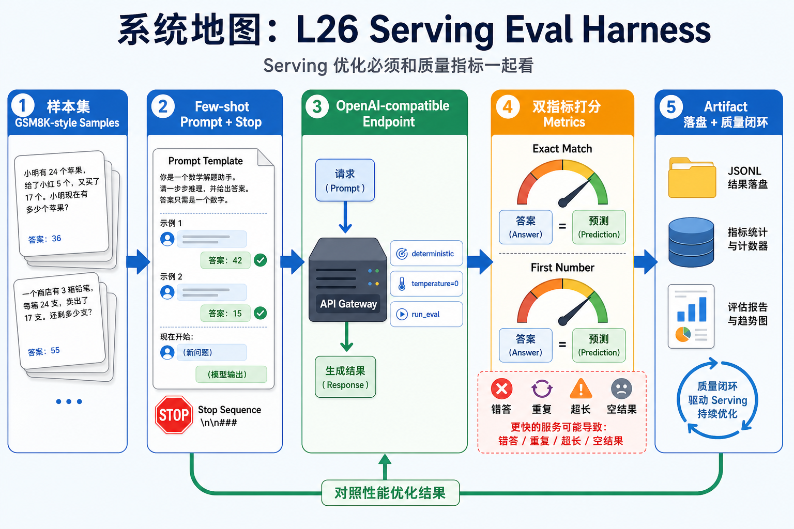
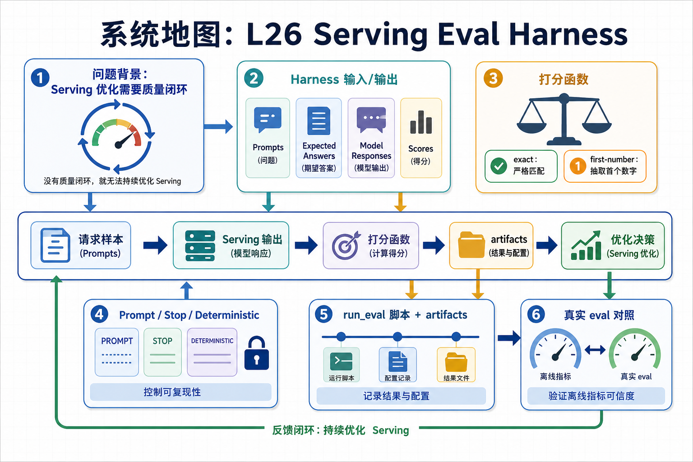

# 系统地图：L26 Serving Eval Harness

L26 讲推理服务的质量评测闭环。性能优化的结果必须和质量指标一起看，否则服务可能更快地输出错误答案、重复题目、超长回答或空结果。本讲用一个 GSM8K-style harness 把样本、few-shot prompt、OpenAI-compatible endpoint、双指标打分和 artifact 落盘串起来。

## 1. Serving Eval Harness 系统图

系统图把评测请求送到 OpenAI-compatible endpoint：固定 prompt、stop 和采样参数，收集 response，再用 exact 或 first-number scorer 形成质量闭环。

## 2. endpoint、prompt、scorer、质量闭环概念图

概念依赖是 endpoint 可用性只是第一层，prompt 渲染和 deterministic 设置决定可复现性，scorer 决定错误类型如何被统计，服务日志负责解释失败。

## 3. 本课边界

- patch 覆盖最小 GSM8K harness，不代表完整 lm-eval。
- 服务优化不能只看吞吐，必须保留质量指标。
- 报告要记录模型、endpoint、生成参数、完成率和解析失败样例。
