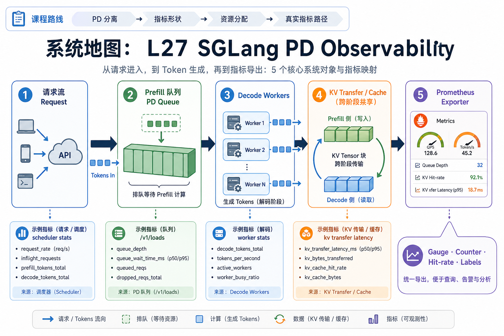
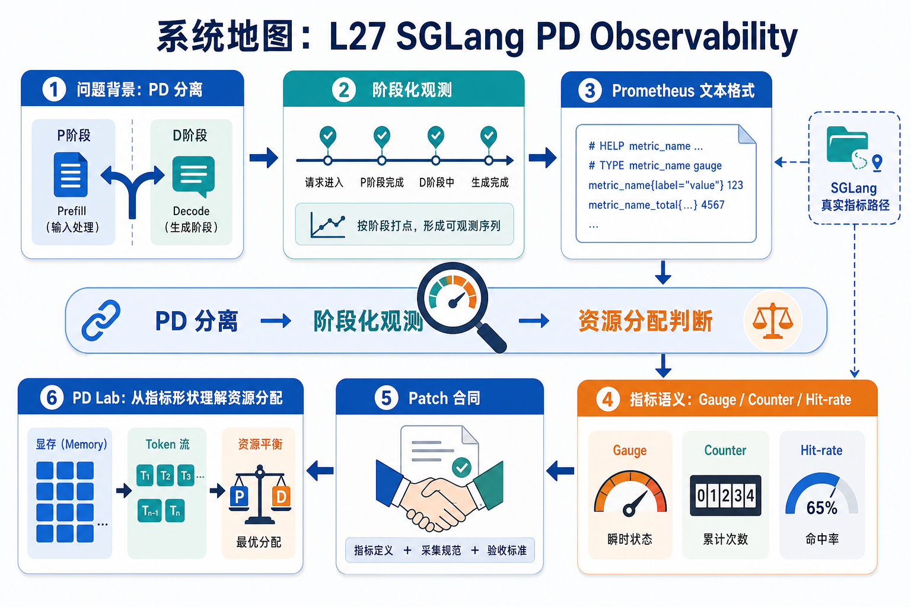

# 系统地图：L27 SGLang PD Observability

L27 讲推理服务可观测性，具体落在 SGLang prefill/decode 分离和 Prometheus 指标导出。学生先写一个最小 exporter，再把 gauge/counter/hit-rate 和 label 语义映射到 SGLang 的 scheduler stats、`/v1/loads`、PD queue 和 KV transfer 指标。

## 1. PD Observability 指标系统图

系统图把 prefill/decode 分离后的运行状态导出成 Prometheus 文本：queue depth、transfer bytes、cache hit、error count 等指标进入观测面板。

## 2. Gauge、Counter、Hit-rate 概念图

概念依赖是 Gauge 描述当前值，Counter 描述累计事件，hit-rate 由命中和总数共同决定。PD 分离后如果没有阶段化指标，就很难判断瓶颈在 prefill、decode 还是 transfer。

## 3. 本课边界

- patch 验证 metric state 和导出文本格式。
- PD lab 的资源判断必须按阶段读指标。
- 真实 Prometheus 还要考虑 scrape 周期、label 维度和高基数问题。
