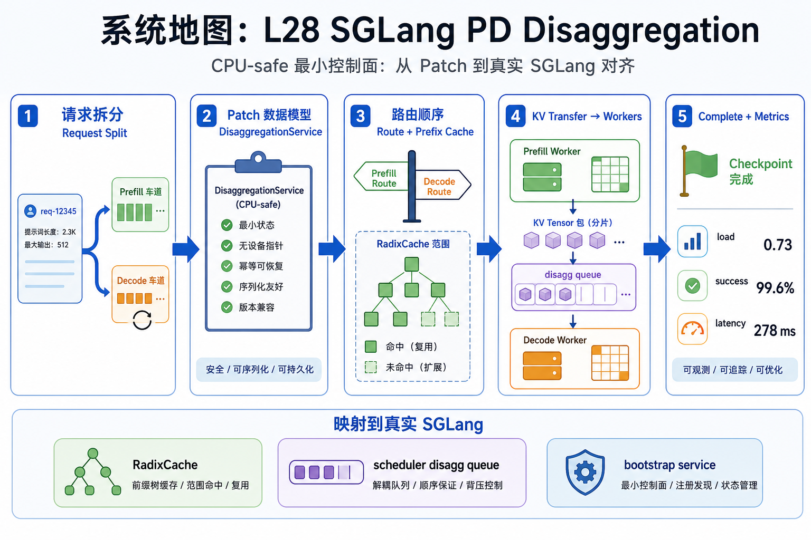
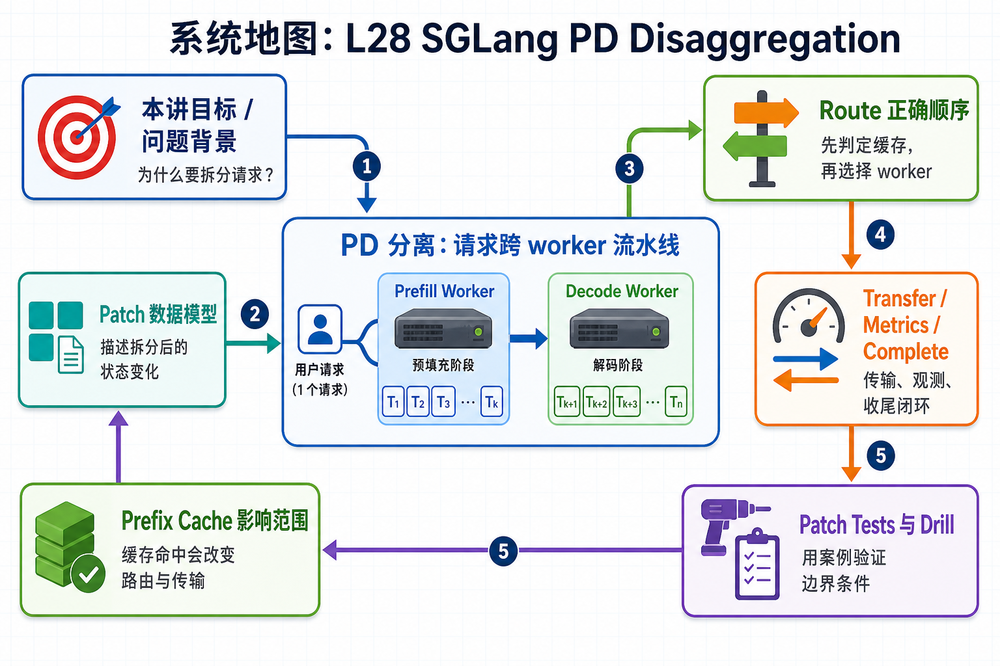

# 系统地图：L28 SGLang PD Disaggregation

L28 讲 SGLang prefill/decode 分离中的最小控制面。学生先实现一个 CPU-safe 的 `DisaggregationService`，再把 route、prefix cache、KV transfer、worker load 和 complete 映射到真实 SGLang 的 RadixCache、scheduler disagg queue 和 bootstrap service。

## 1. PD Disaggregation 与 KV Transfer 系统图

系统图把一个请求拆成 prefill worker 和 decode worker：prefix cache 先影响路由，KV transfer 搬运上下文状态，complete 再更新 metrics 和 worker load。

## 2. route、prefix cache、transfer、complete 概念图

概念依赖是先判断 prefix cache 是否命中，再选择 worker 和 transfer 计划；metrics/history 记录跨 worker 边界，complete 负责释放或更新负载。

## 3. 本课边界

- patch 使用简化数据模型验证 route/transfer/complete。
- 真实 PD 还会受网络、KV 格式、worker 异步状态影响。
- 排查时要同时看 prefix hit、transfer history、worker load 和错误路径。
