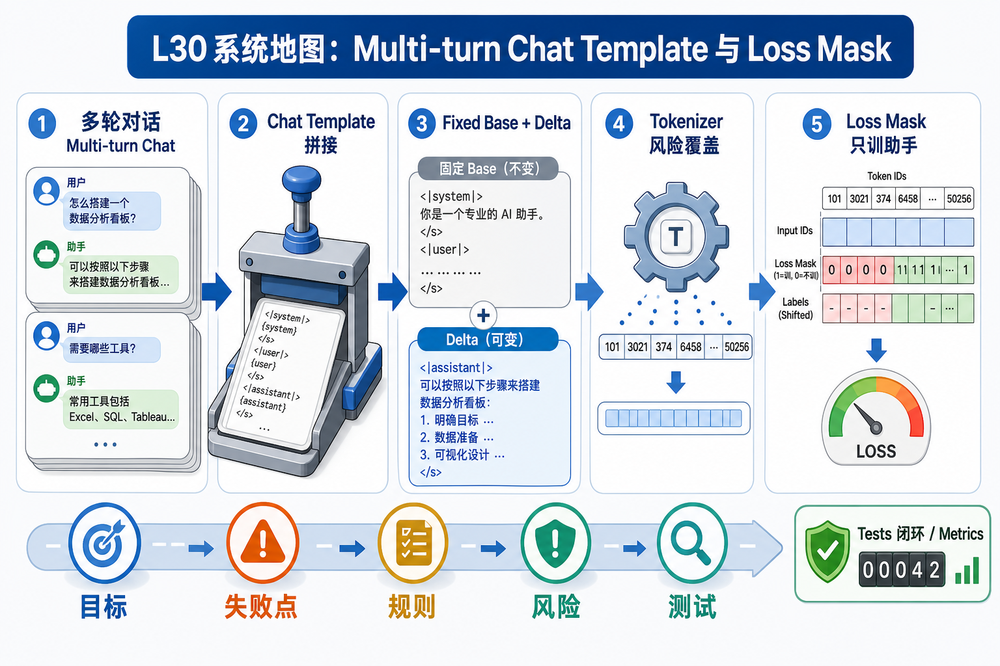
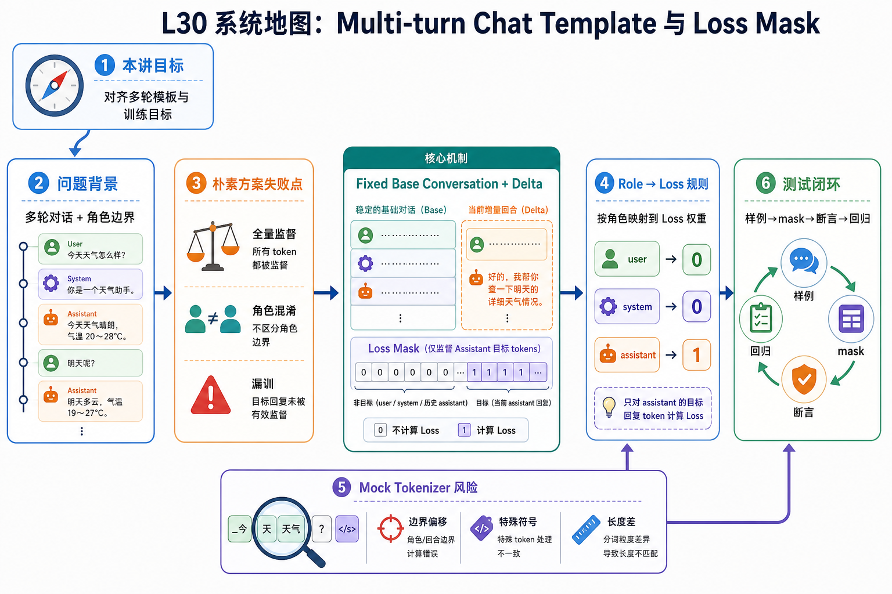

# L30 系统地图：Multi-turn Chat Template 与 Loss Mask

这节课的第一屏不再用复杂系统地图展开，而是先用一张生成图片建立直觉，再进入讲义和源码。

## 1. Multi-turn Chat Mask 系统图

系统图从 fixed base conversation 开始：新增一轮 delta，按 role 决定哪些 token 参与 loss，再把多轮模板条件渲染映射成稳定 labels。

## 2. base conversation、delta、role mask 概念图

概念依赖是先固定共同前缀，再比较新增 token；role 决定 loss 开关，mock tokenizer 暴露真实模板里 generation marker 和分支条件的风险。

## 3. 本课边界

- patch 聚焦多轮 delta 和 role-to-loss 规则。
- 不要依赖模板库自动返回 assistant mask，很多模型覆盖不完整。
- 排查时先打印每段 token 的角色、文本和 label。
