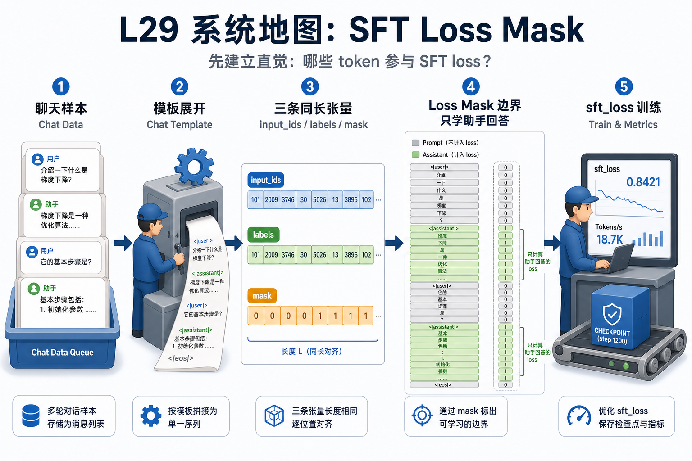
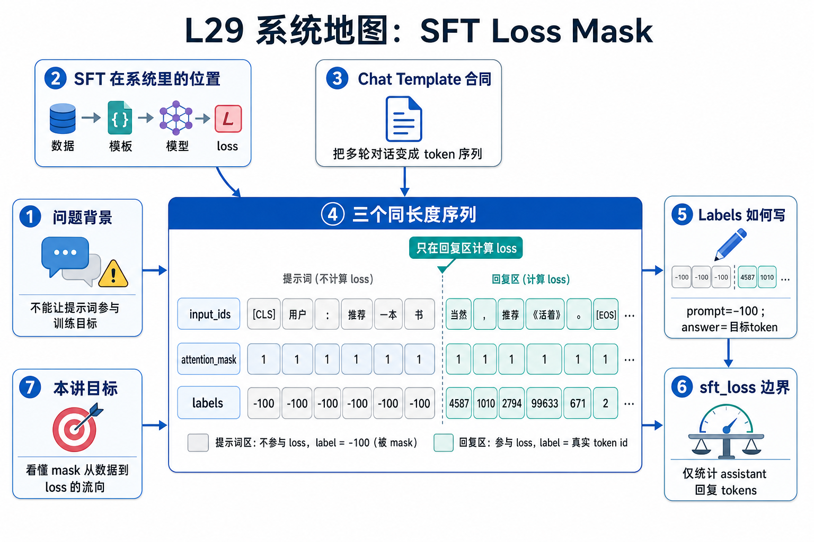

# L29 系统地图：SFT Loss Mask

这节课的第一屏不再用复杂系统地图展开，而是先用一张生成图片建立直觉，再进入讲义和源码。

## 1. SFT Loss Mask 系统图

系统图把 instruction/chat 样本变成训练序列：chat template 渲染角色文本，tokenizer 产出 input_ids，labels 只在 assistant completion 上保留 loss。

## 2. chat template、labels、assistant-only loss 概念图

概念依赖是 input_ids、attention_mask、labels 必须同长度；用户 token 和模板 token 的 label 要写成 ignore_index，只有需要学习的 assistant token 进入 loss。

## 3. 本课边界

- patch 使用简化 tokenizer 合同训练 loss mask。
- 真实 Qwen/Llama 模板可能有特殊 token 和 generation marker。
- 训练排查要先看渲染文本、token 分段和 labels 对齐。
