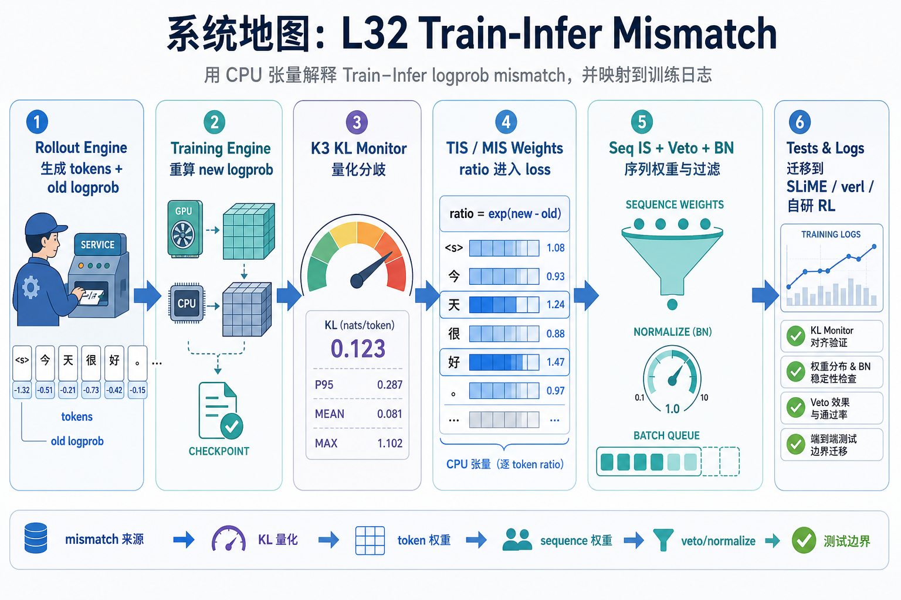
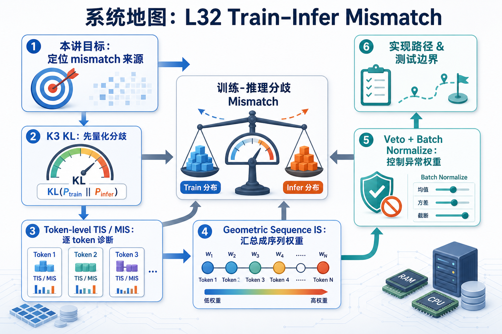

# 系统地图：L32 Train-Infer Mismatch

本讲把 rollout engine 和 training engine 之间的 logprob 不一致拆成可观察、可修正、可测试的几类算子。目标聚焦在用 CPU 张量解释 ratio 如何进入 loss，并把同一套判断迁移到 SLiME、verl 或自研 RL pipeline 的训练日志。

## 1. Train-Infer Mismatch 系统图

系统图把训练策略和推理策略的分歧量化：先用 K3 KL 看 token 分布差异，再用 TIS/MIS/GSIS 调整贡献，最后用 veto 和 normalize 控制异常权重。

## 2. K3 KL、TIS、MIS、GSIS 概念图

概念依赖是 KL 先告诉你分歧有多大，TIS 处理连续 token 权重，MIS 切掉信任区间外贡献，GSIS 把 token 权重汇成 sequence 权重。

## 3. 本课边界

- patch 只覆盖 mismatch 估计和权重规则。
- 生产配置常把 token-level、sequence-level 和 veto 组合使用。
- 排查时要看分布差异、权重极值、normalize 前后和被 veto 样本。
