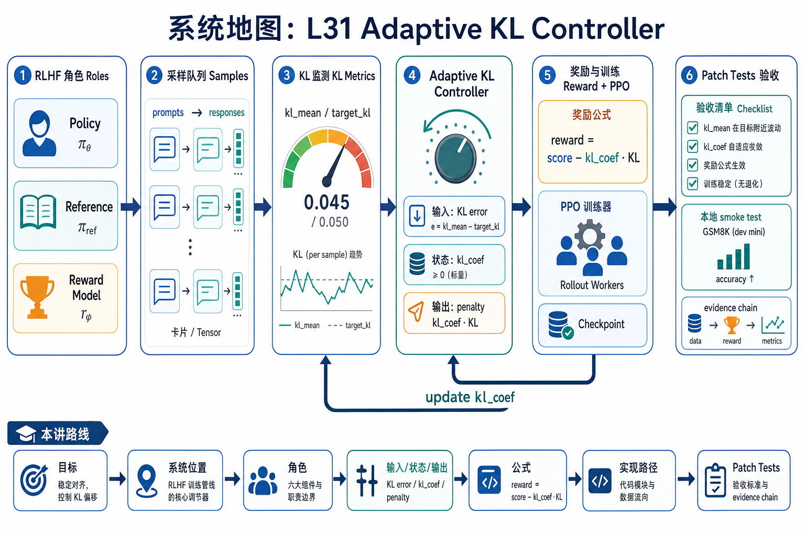
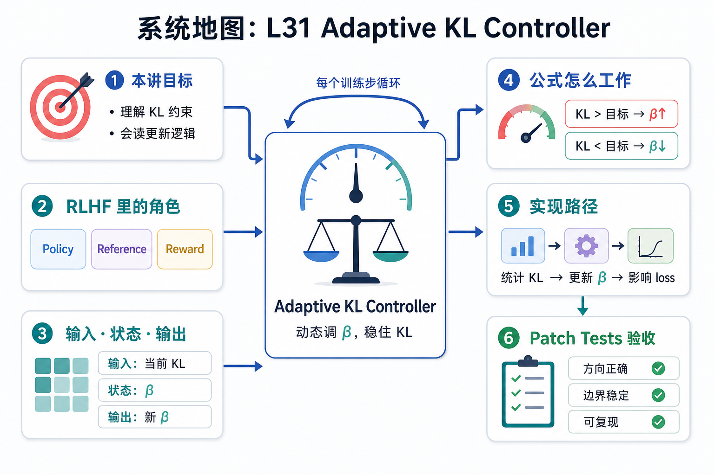

# 系统地图：L31 Adaptive KL Controller

L31 是 RL 与对齐章节的第一节控制器课。学生先写 Adaptive KL Controller，再用本地 GSM8K reward smoke 验证数据、奖励和 metrics 证据链，最后对照 SLiME 的 PPO utils 和 async train loop。

## 1. Adaptive KL Controller 系统图

系统图把 PPO/RLHF 的几个角色连起来：policy 生成 response，reference 提供 KL 基准，reward 给偏好信号，KL controller 根据目标区间调节系数。

## 2. policy、reference、reward、KL coef 概念图

概念依赖是 measured KL 先和 target 比较，controller 再用 horizon 平滑更新 `kl_coef`。系数太小会漂移，太大会压制学习。

## 3. 本课边界

- patch 只实现 adaptive KL controller，不跑完整 PPO。
- 真实 verl 还包含 rollout、advantage、actor/critic 和分布式资源。
- 报告要记录 target、horizon、当前 KL 和系数更新方向。
