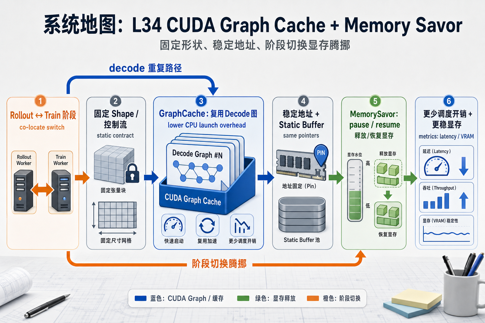
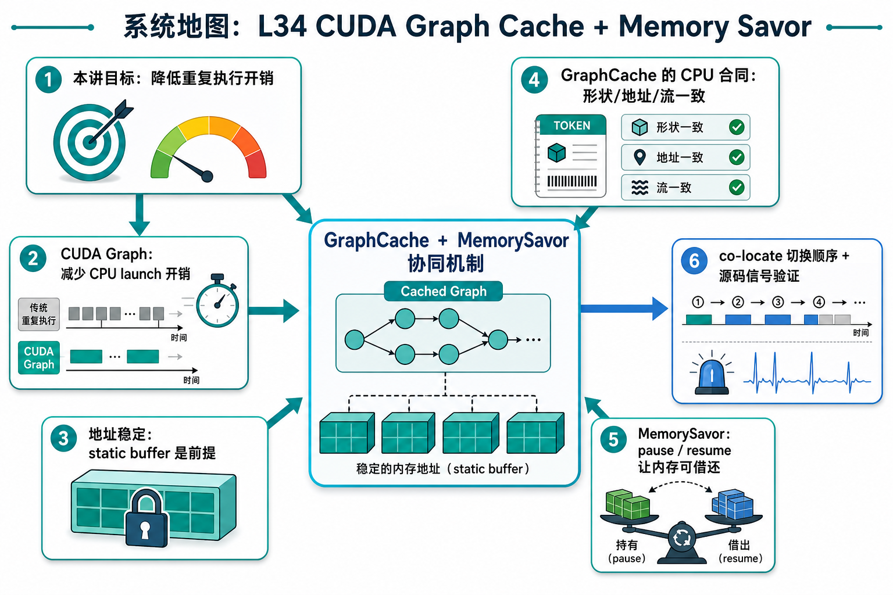

# 系统地图：L34 CUDA Graph Cache + Memory Savor

L34 把 RL co-locate 的两个底层约束放在同一张图里：CUDA Graph 需要固定 shape、固定控制流和稳定地址；co-locate 又需要在 rollout 和 train 阶段之间让出显存。GraphCache 解决重复 decode 的调度开销，MemorySavor 解决阶段切换时的显存腾挪。

## 1. CUDA Graph Cache + Memory Savor 系统图

系统图展示 co-locate RL 中 decode 和 training 轮换：rollout 侧用 CUDA Graph 缓解 CPU launch，training 侧用 MemorySavor 暂停/恢复释放显存。

## 2. static buffer、graph replay、pause/resume 概念图

概念依赖是 CUDA Graph 要求 shape、控制流和地址稳定；static buffer 保证 replay 地址不变；MemorySavor 负责在训练阶段让 rollout 占用降下来。

## 3. 本课边界

- patch 是 CPU 合同，不录制真实 CUDA Graph。
- 真实 replay 是否稳定取决于 allocator、shape bucket 和 buffer 生命周期。
- co-locate 切换顺序错误会同时破坏显存和 graph cache。
