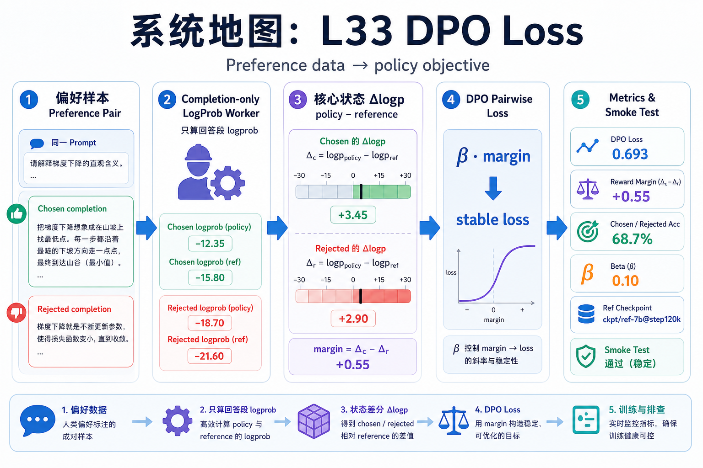
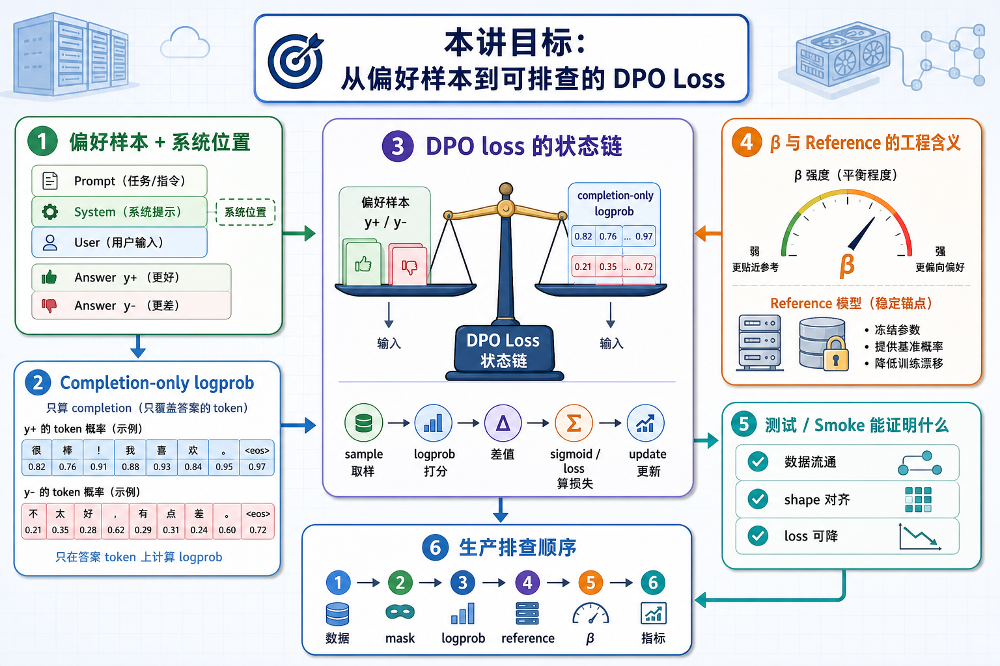

# 系统地图：L33 DPO Loss

DPO 把偏好数据直接转成 policy 优化目标。它的输入是同一个 prompt 下的 chosen/rejected completion，核心状态是 policy 与 reference 对这两条 completion 的 log-prob 差，输出是一个稳定的 pairwise loss 和一组可排查指标。

## 1. DPO Loss 系统图

系统图把偏好样本拆成 chosen/rejected 两条 completion，分别计算 policy 和 reference logprob，再用 beta 缩放差值形成 DPO loss。

## 2. chosen、rejected、reference、beta 概念图

概念依赖是 completion-only logprob 先排除 prompt，policy-reference 差值再表示相对偏好，beta 控制偏好约束强度。reference 缺失会让目标退化。

## 3. 本课边界

- patch 验证 DPO 数学和 mask，不训练偏好模型。
- 生产排查要先看 logprob、mask、chosen/rejected 是否对齐。
- beta、reference checkpoint 和数据质量共同决定训练稳定性。
