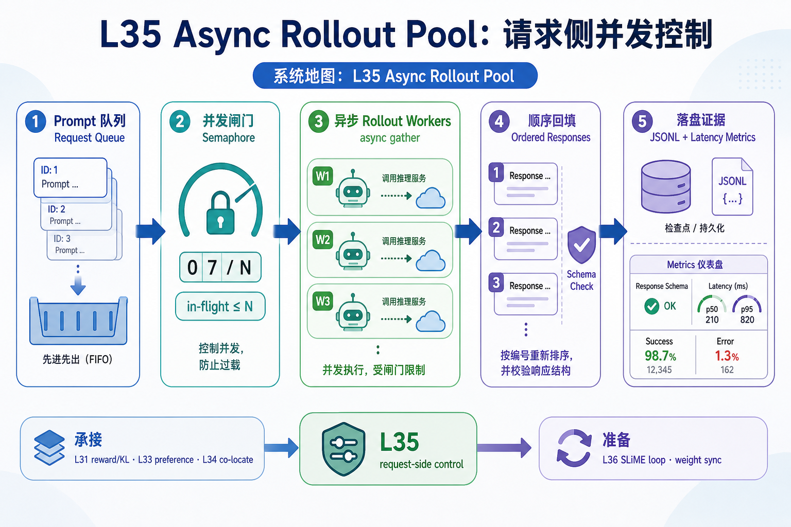
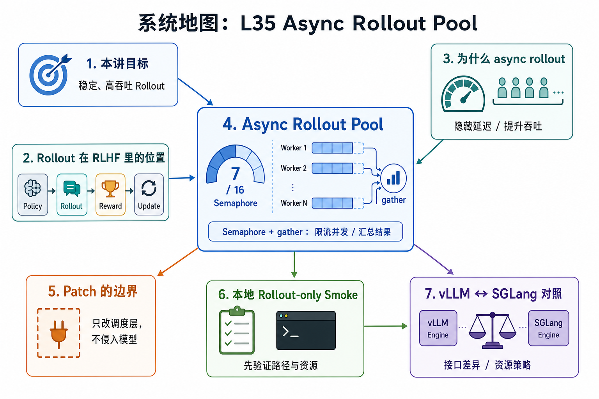

# 系统地图：L35 Async Rollout Pool

L35 讲 RL rollout 的请求侧控制：客户端如何并发提交 prompt、限制在途请求数、保留输出顺序，并把 response schema 与 latency 指标落盘。它连接 L31 的 reward/KL 证据链、L33 的偏好优化和 L34 的 co-locate 资源边界，也为 L36 的 SLiME 训练循环和 weight sync 做准备。

## 1. Async Rollout Pool 系统图

系统图把 RLHF rollout 变成受控并发：prompt 进入任务池，Semaphore 限流，async gather 保持结果身份，rollout-only smoke 再验证 endpoint 与样本顺序。

## 2. Semaphore、gather、样本身份概念图

概念依赖是并发提高吞吐，但必须保留 prompt/response 的一一对应。Semaphore 管资源上限，gather 汇总任务，样本 id 让后续 reward 和训练不串行错配。

## 3. 本课边界

- patch 只覆盖本地 async pool。
- 真实系统还会有 Ray actor、HTTP retry、reward model、dynamic filter 和 abort。
- rollout 报告要记录并发、完成率、顺序一致性和失败样本。
