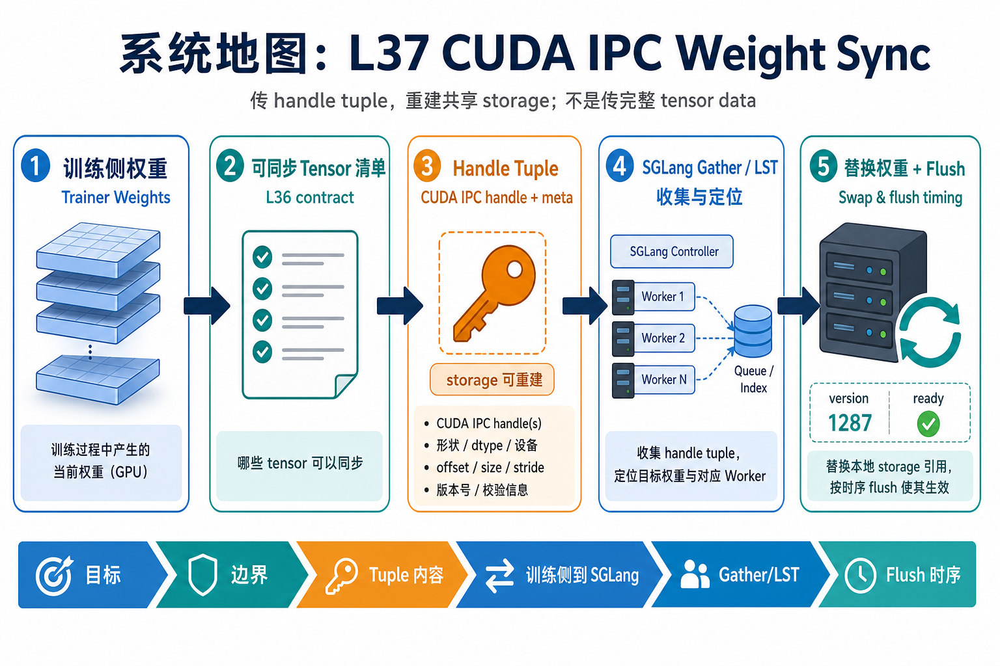
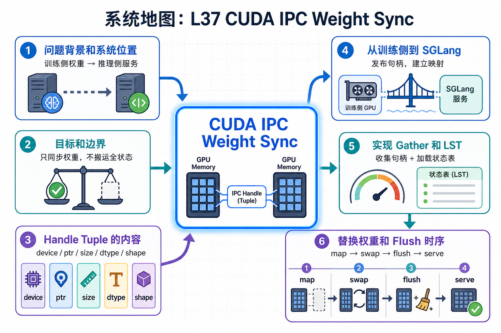

# 系统地图：L37 CUDA IPC Weight Sync

L37 位于 L36 weight sync 合同之后。L36 关注哪些 tensor 可以同步；L37 关注 co-locate 路径实际传什么：可重建共享 storage 的 handle tuple，而非完整 tensor data。

## 1. CUDA IPC Weight Sync 系统图

系统图把训练进程的 tensor storage 通过 CUDA IPC handle 共享给 rollout 进程：handle tuple 描述设备、shape、stride、dtype 和 storage 偏移，接收侧再重建视图。

## 2. handle tuple、shared storage、flush 时序概念图

概念依赖是 handle 只共享同机 GPU storage，不是跨节点复制；gather/LST 决定收集哪些参数，replace/flush 决定 rollout 何时安全看见新权重。

## 3. 本课边界

- patch mock handle tuple 和同步时序，不调用真实 CUDA IPC。
- 真实系统依赖同机共享、进程生命周期和 storage 对齐。
- 错误通常出在 dtype/shape/stride、版本时序或 flush 缺失。
