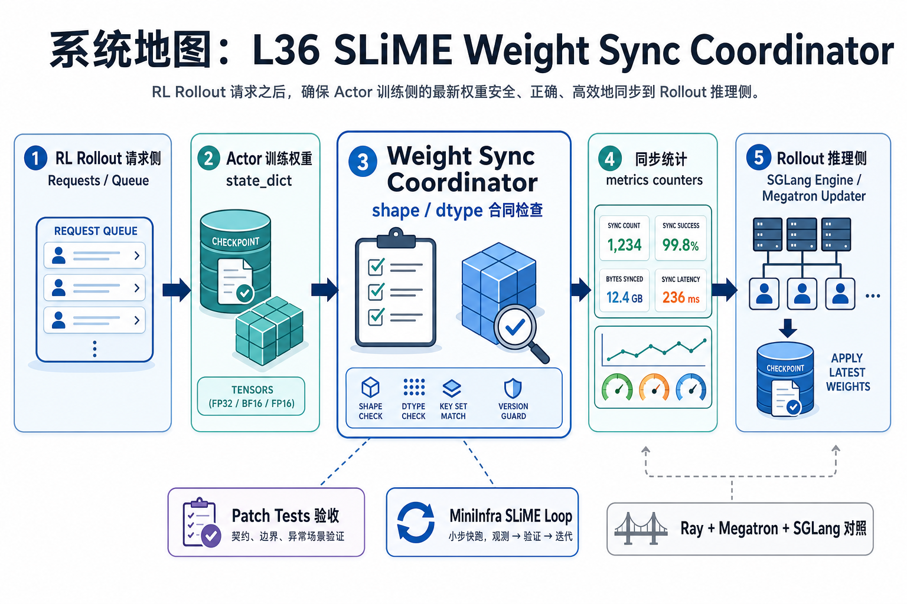
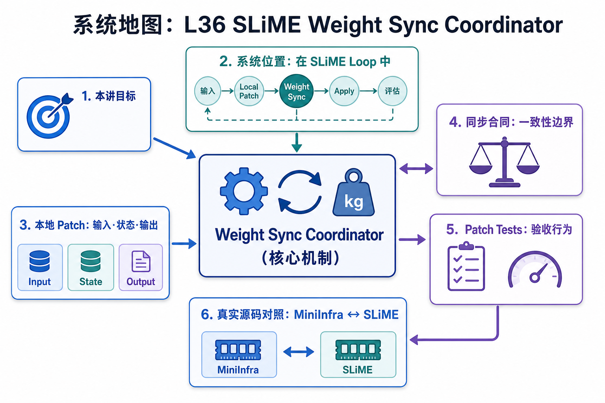

# 系统地图：L36 SLiME Weight Sync Coordinator

L36 位于 RL rollout 请求侧之后，处理 actor 训练侧和 rollout 推理侧之间的权重交接。它先用本地 `state_dict` 合同练清 shape/dtype 检查和同步统计，再对照 SLiME 的 Ray、Megatron updater 和 SGLang engine。

## 1. SLiME Weight Sync Coordinator 系统图

系统图把训练侧权重同步到 rollout 侧：coordinator 收集版本和状态，决定何时 sync，应用权重后更新 freshness，防止 rollout 用过期 policy。

## 2. sync request、version、freshness 概念图

概念依赖是训练 step 推进 policy version，rollout 侧必须知道自己服务的是哪个版本。同步合同要明确 pending、applied、failed 和 stale 的状态转移。

## 3. 本课边界

- patch 验证 coordinator 状态机，不搬运真实大权重。
- 真实 SLiME 还要处理 actor、IPC、显存驻留和故障恢复。
- 排查 rollout 质量先确认权重版本和 freshness。
