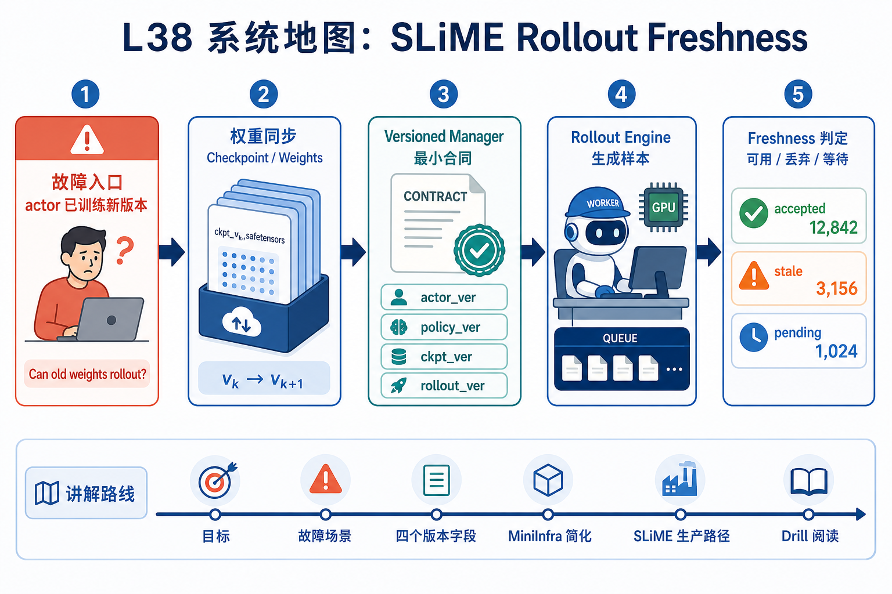
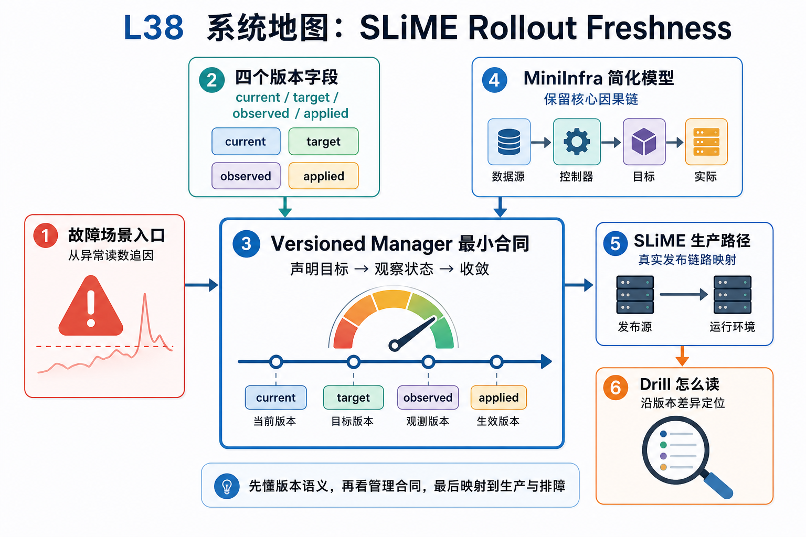

# L38 系统地图：SLiME Rollout Freshness

本讲回答一个具体问题：actor 已经训练到新版本后，rollout engine 还能不能继续用旧权重生成训练样本。L36/L37 讲权重怎样被同步到推理侧；L38 讲同步后如何用版本证据决定 rollout 是否可用。

## 1. Versioned Rollout Freshness 系统图

系统图把 rollout manager 变成版本守门员：记录 policy_version、rollout_version、accepted/rejected 状态，拒绝太旧样本进入训练。

## 2. policy version、rollout version、staleness 概念图

概念依赖是训练权重每更新一次，rollout 样本就带上生成时的版本。freshness rule 决定样本是否仍可信，否则旧 policy 的数据会污染当前优化。

## 3. 本课边界

- patch 验证 versioned manager 的最小合同。
- 真实 SLiME 还会叠加异步 actor、队列和全局数据集。
- 排查时要看样本生成版本、当前训练版本和丢弃原因。
