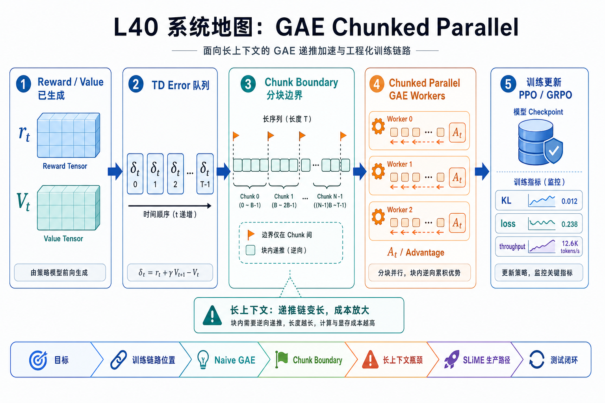
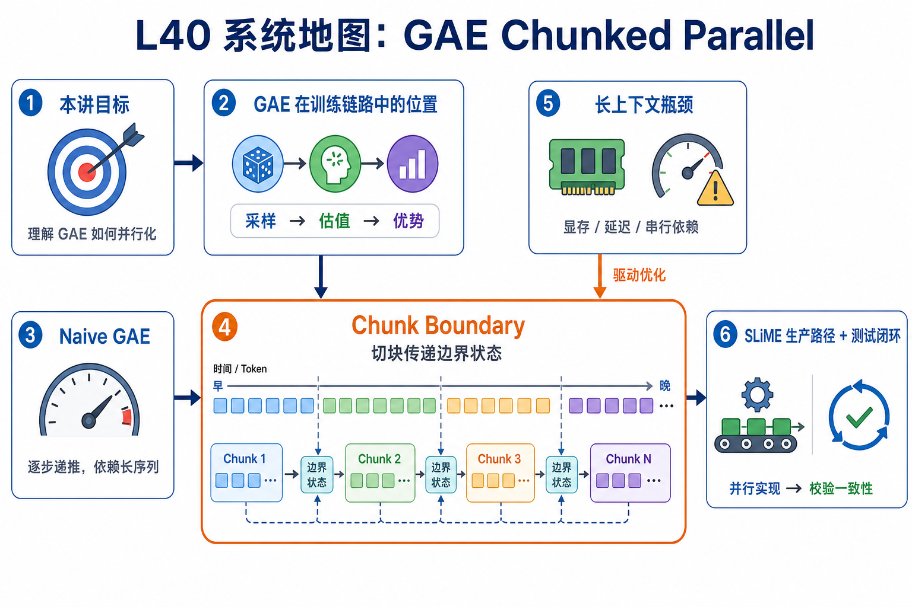

# L40 系统地图：GAE Chunked Parallel

L40 处理 PPO/GRPO 训练里的 GAE 递推。reward 和 value 已经产生后，训练侧需要把每个 token 的 TD error 累积成 advantage；长上下文会放大这条反向链的实现成本。

## 1. GAE Chunked Parallel 系统图

系统图把长序列 advantage 计算切成 chunk：每段局部反向递推，边界传递 bootstrap 信息，最后拼回完整 GAE，减少单段计算压力。

## 2. reverse recurrence、chunk boundary、bootstrap 概念图

概念依赖是 GAE 本质上从尾到头递推，chunk 化后必须把边界 carry 传对；否则每段内部看似正确，拼接处 advantage 会断。

## 3. 本课边界

- patch 验证 chunk 边界和数值等价。
- 长上下文生产路径还要处理 padding、mask 和并行调度。
- 排查时先比较 naive GAE 与 chunked GAE 的边界位置差异。
