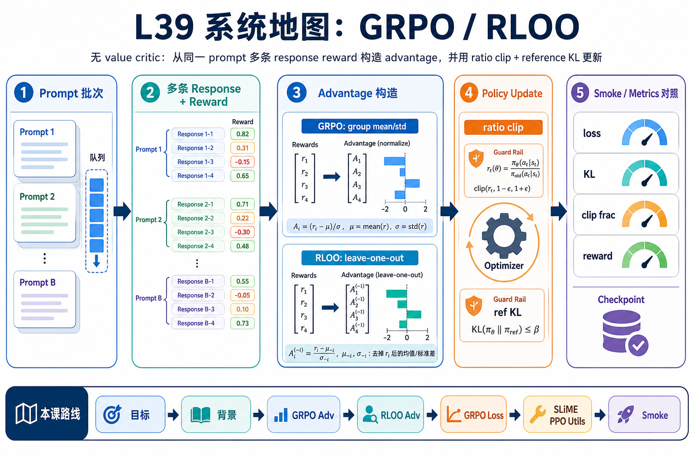
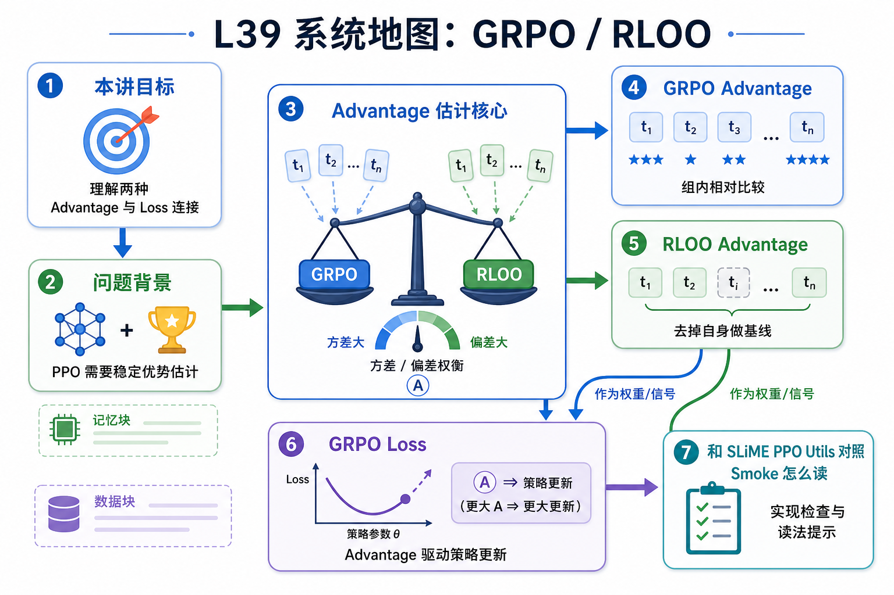

# L39 系统地图：GRPO / RLOO

L39 讲 policy optimization 层的一个具体问题：没有 value critic 时，如何从同一 prompt 的多条 response reward 中构造 advantage，并用 ratio clip 与 reference KL 约束更新。

## 1. GRPO/RLOO 训练系统图

系统图把同一 prompt 的多条 response 放进 group：reward 形成组内相对优势，GRPO/RLOO 省掉 value critic，再把 advantage、mask、KL 组合进 policy loss。

## 2. group baseline、advantage、KL loss 概念图

概念依赖是 group reward 先提供相对 baseline，advantage 决定更新方向，mask 决定哪些 token 参与，KL 约束保证 policy 不离参考模型太远。

## 3. 本课边界

- patch 验证 GRPO/RLOO advantage 和 loss 形状。
- 真实训练质量高度依赖 group 采样、reward parser 和数据过滤。
- 报告要看 reward 分布、组大小、mask 覆盖率和 KL。
