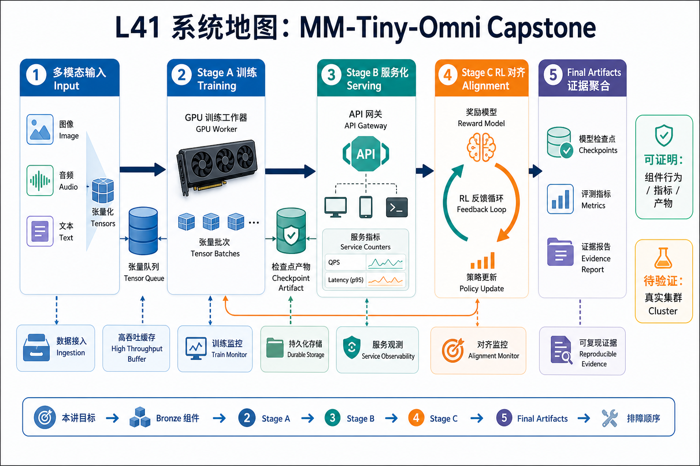
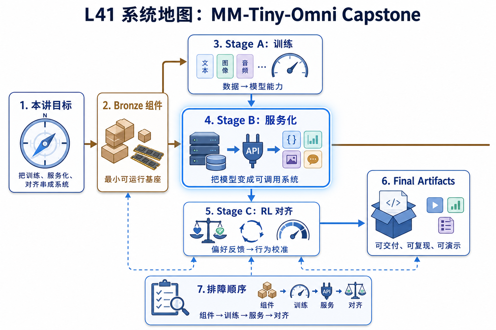

# L41 系统地图：MM-Tiny-Omni Capstone

L41 是课程收口。它把多模态输入、训练、服务、RL 和最终证据聚合到一个项目里，要求学生说明每个阶段能证明什么，也说明哪些结论还需要真实集群验证。

## 1. MM-Tiny-Omni Capstone 系统图

系统图把课程收束成三阶段交付：Bronze 组件准备输入和证据，Stage A 训练，Stage B 服务化，Stage C 做 RL 对齐，最后汇总 final artifacts。

## 2. 训练、服务、RL、最终证据概念图

概念依赖是多模态数据先能稳定 collate，训练产物才能服务化；服务接口稳定后才能采集 rollout；RL 对齐后的结论必须回到指标、日志和报告。

## 3. 本课边界

- capstone 关注端到端证据链，不要求每个生产细节都完整复刻。
- 每个阶段都要写清能证明什么、不能证明什么。
- 最终交付要把配置、日志、metrics、报告和 artifact 关联起来。
